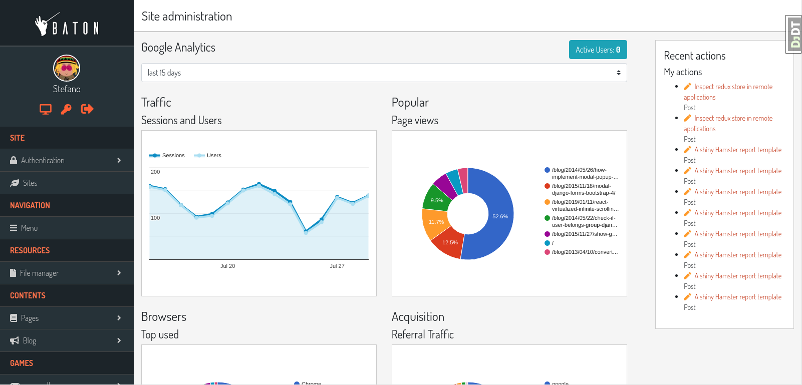
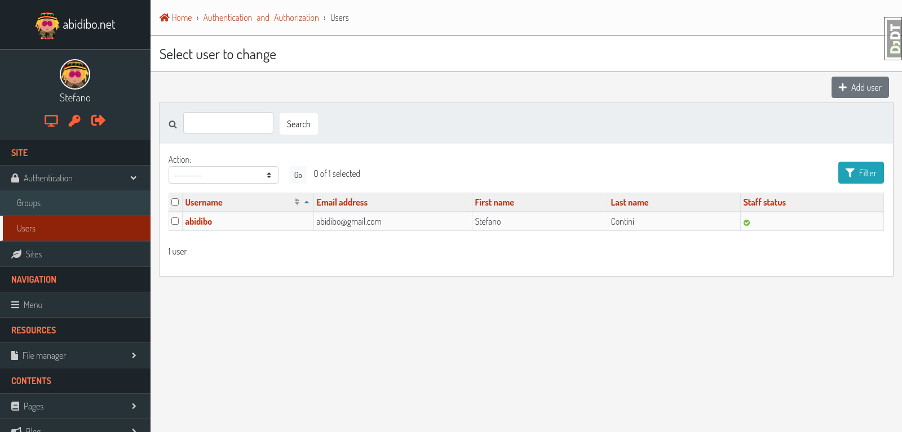
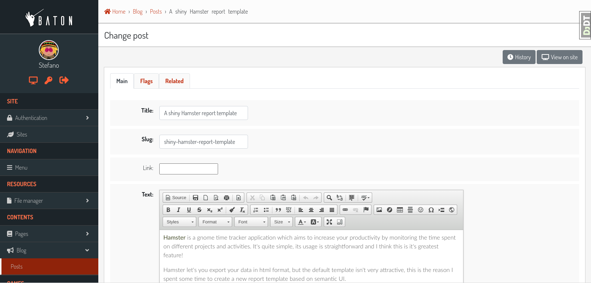

# django-baton


[](https://travis-ci.com/github/otto-torino/django-baton)

[](https://pepy.tech/project/django-baton)

A cool, modern and responsive django admin application based on bootstrap 4.5.0

Documentation: [readthedocs](http://django-baton.readthedocs.io/)

---
**Live Demo**

Now you can try django-baton using the new shining live demo!
Login with user `demo` and password `demo`

[https://django-baton-demo.herokuapp.com/](https://django-baton-demo.herokuapp.com/)

---



## Table of contents

- [Features](#features)
- [Installation](#installation)
- [Configuration](#configuration)
    - [Menu](#configuration-menu)
    - [Analytics](#configuration-analytics)
- [Signals](#signals)
- [Text Input Filters](#text-input-filters)
- [Form Tabs](#form-tabs)
- [Form Includes](#form-includes)
- [Collapsable stacked inlines entries](#collapsable-stackedinline)
- [Customization](#customization)
- [Tests](#tests)
- [Contributing](#contributing)
- [Screenshots](#screenshots)

## <a name="features"></a>Features

Supports Django >= 1.11

This application was written with one concept in mind: overwrite as few django templates as possible.
Everything is styled through CSS and when required, JS is used.

- Based on bootstrap 4.5.0 and FontAwesome Free 5.8.1
- Fully responsive
- Custom and flexible sidebar menu
- Text input filters facility
- Form tabs out of the box
- Easy way to include templates in the change form page
- Collapsable stacke inline entries
- Lazy loading of uploaded images
- Optional display of changelist filters in a modal
- Optional index page filled with google analytics widgets
- Customization available for recompiling the js app provided
- IT translations provided

The following packages are required to manage the Google Analytics index:

- google-auth
- google-auth-httplib2
- google-api-python-client
- requests

At the moment __baton__ defines only 4 custom templates:

- `admin/base_site.html`, needed to inject the JS application (which includes css and images, compiled with [webpack](https://webpack.github.io/));
- `admin/change_form.html`, needed to inject the `baton_form_includes` stuff. In any case, the template extends the default one and just adds some stuff at the end of the content block, so it's still full compatible with the django one;
- `admin/delete_confirmation.html`, needed to wrap contents;
- `admin/delete_selected_confirmation.html`, same as above.

Baton is based on the following frontend technologies:

- bootstrap 4.5.0
- FontAwesome 5.8.1 (solid and brands)

Flexbox is used to accomplish responsiveness. jQuery is used for DOM manipulations.

All JS, fonts and CSS are compiled, and produce a single JS file which is included in the base_site template.

A custom menu is provided, the menu is rendered through JS, and data is fetched in JSON format through an AJAX request.

## <a name="installation"></a>Installation

Install the last stable release

    pip install django-baton

or clone the repo inside your project

    git clone https://github.com/otto-torino/django-baton.git

Add `baton` and `baton.autodiscover` to your `INSTALLED_APPS`:

    INSTALLED_APPS = (
        # ...
        'baton',
        'django.contrib.admin',
        # ... (place baton.autodiscover at the very end)
        'baton.autodiscover',
    )

Replace django.contrib.admin in your project urls, and add baton urls:

    # from django.contrib import admin
    from baton.autodiscover import admin
    from django.urls import path, include

    urlpatterns = [
        path('admin/', admin.site.urls),
        path('baton/', include('baton.urls')),

    ]

If you get a "__No crypto library available__" when using the Google Analytics index, install this package:

    $ pip install PyOpenSSL

### Why two installed apps?

Well, first `baton` has to be placed before the `django.contrib.admin` app, because it overrides 3 templates and resets all CSS.
The `baton.autodiscover` entry is needed as the last installed app in order to register all applications for the admin.
I decided to create a custom `AdminSite` class, to allow the customization of some variables the Django way (`site_header`, `index_title`, ...). I think it's a good approach to customize these vars instead of overwriting the orignal templates. The problem is that when creating a custom AdminSite, you have to register all the apps manualy. I didn't like
that so I wrote this `autodiscover` module which automatically registers all the apps registered with the Django's default AdminSite. For this to work, all the apps must be already registered so this app should be the last in `INSTALLED_APPS`.

## <a name="configuration"></a>Configuration

The configuration dictionary must be defined inside your settings:

    BATON = {
        'SITE_HEADER': 'Baton',
        'SITE_TITLE': 'Baton',
        'INDEX_TITLE': 'Site administration',
        'SUPPORT_HREF': 'https://github.com/otto-torino/django-baton/issues',
        'COPYRIGHT': 'copyright © 2017 <a href="https://www.otto.to.it">Otto srl</a>', # noqa
        'POWERED_BY': '<a href="https://www.otto.to.it">Otto srl</a>',
        'CONFIRM_UNSAVED_CHANGES': True,
        'SHOW_MULTIPART_UPLOADING': True,
        'ENABLE_IMAGES_PREVIEW': True,
        'CHANGELIST_FILTERS_IN_MODAL': True,
        'CHANGELIST_FILTERS_ALWAYS_OPEN': False,
        'MENU_ALWAYS_COLLAPSED': False,
        'MENU_TITLE': 'Menu',
        'GRAVATAR_DEFAULT_IMG': 'retro',
        'MENU': (
            { 'type': 'title', 'label': 'main', 'apps': ('auth', ) },
            {
                'type': 'app',
                'name': 'auth',
                'label': 'Authentication',
                'icon': 'fa fa-lock',
                'models': (
                    {
                        'name': 'user',
                        'label': 'Users'
                    },
                    {
                        'name': 'group',
                        'label': 'Groups'
                    },
                )
            },
            { 'type': 'title', 'label': 'Contents', 'apps': ('flatpages', ) },
            { 'type': 'model', 'label': 'Pages', 'name': 'flatpage', 'app': 'flatpages' },
            { 'type': 'free', 'label': 'Custom Link', 'url': 'http://www.google.it', 'perms': ('flatpages.add_flatpage', 'auth.change_user') },
            { 'type': 'free', 'label': 'My parent voice', 'default_open': True, 'children': [
                { 'type': 'model', 'label': 'A Model', 'name': 'mymodelname', 'app': 'myapp' },
                { 'type': 'free', 'label': 'Another custom link', 'url': 'http://www.google.it' },
            ] },
        ),
        'ANALYTICS': {
            'CREDENTIALS': os.path.join(BASE_DIR, 'credentials.json'),
            'VIEW_ID': '12345678',
        }
    }

- `SITE_HEADER`, `COPYRIGHT` and `POWERED_BY` are marked as safe, so you can include img tags and links.
- `SUPPORT_HREF` is the URL of the support link. For instance, you can use `mailto:info@blabla.com`.
- `CONFIRM_UNSAVED_CHANGES`: if set to `True` a confirmation modal appears when leaving a change form or add form with unsaved changes.
The check of a dirty form relies on the jQuery serialize method, so it's not 100% safe. Disabled inputs, particular widgets (ckeditor) can not be detected.
Default value is `True`.
- `SHOW_MULTIPART_UPLOADING`: if set to `True` an overlay with a spinner appears when submitting a `multipart/form-data` form.
- `ENABLE_IMAGES_PREVIEW`: if set to `True` a preview is displayed above all input file fields which contain images. You can control how the preview is displayed by overriding the class `.baton-image-preview`. By default, previews have 100px height and with a box shadow (on "hover").
- `CHANGELIST_FILTERS_IN_MODAL`: if set to `True` the changelist filters are opened in a centered modal above the document, useful when you set many filters. By default, its value is `False` and the changelist filters appears from the right side of the changelist table.
- `CHANGELIST_FILTERS_ALWAYS_OPEN`: if set to `True` the changelist filters are opened by default. By default, its value is `False` and the changelist filters can be expanded clicking a toggler button. This option is considered only if `CHANGELIST_FILTERS_IN_MODAL` is `False`.
- `COLLAPSABLE_USER_AREA`: if set to `True` the sidebar user area is collapsed and can be expanded to show links.
- `MENU_ALWAYS_COLLAPSED`: if set to `True` the menu is hidden at page load, and the navbar toggler is always visible, just click it to show the sidebar menu.
- `MENU_TITLE`: the menu title shown in the sidebar. If an empty string, the menu title is hidden and takes no space on larger screens, the default menu voice will still be visible in the mobile menu.
- `GRAVATAR_DEFAULT_IMG`: the default gravatar image displayed if the user email is not associated to any gravatar image. Possible values: 404, mp, identicon, monsterid, wavatar, retro, robohash, blank (see [http://en.gravatar.com/site/implement/images/](http://en.gravatar.com/site/implement/images/)).

`MENU` and `ANALYTICS` configurations in detail:

### <a name="configuration-menu"></a>MENU

Currently four kind of voices are supported: _title_, _app_, _model_ and _free_.

Title and free voices can have children, which follow the following rules:

- children voices' children are ignored (do not place an app voice as a child)

Voices with children (title, app, free) can specify a `default_open` key to expand the submenu by default.

If you don't define a MENU key in the configuration dictionary, the default MENU is shown.

#### Title

Like __MAIN__ and __CONTENTS__ in the screenshot, it represents a menu section. You should set a label and optionally apps or perms key, used for visualization purposes.

If the title voice should act as a section title for a group of apps, you'd want to specify these apps, because if the user can't operate over them, then the voice is not shown.
You can also define some perms (OR condition), like this:

    { 'type': 'title', 'label': 'main', 'perms': ('auth.add_user', ) },

Free voices can have children and so you can specify the _default_open_ key.

#### App

You must specify the _type_ and _name_ keys. Optionally, an _icon_ key (you can use FontAwesome classes which are included by default), a _default_open_ key and a _models_ key.
If you don't define the _models_ key, the default app models are listed under your app.

#### Model

You must specify the _type_, _name_ and _app_ keys. Optionally, an icon key.

#### Free

You can specify free voices. You must define a _url_ and if you want some visibility permissions (OR clause). Free voices can have children and so you can specify the _default_open_ key. Free voices also accept a _re_ property, which specifies a regular expression used to decide whether to highlight the voice or not (the regular expression is evaluated against the document location pathname).

	{
	    'type': 'free',
	    'label': 'Categories',
	    'url': '/admin/news/category/',
	    're': '^/admin/news/category/(\d*)?'
	}

### <a name="configuration-analytics"></a>ANALYTICS

You can create a cool index page displaying some statistics widgets using the Google Analytics API just by defining the `ANALYTICS` setting.

It requires two keys:

- `CREDENTIALS`: it is the path to the credentials json file
- `VIEW_ID`: ID of the view from which to display data

You can add contents before and after the analytics dashboard by extending the `baton/analytics.html` template and filling the `baton_before_analytics` and `baton_after_analytics` blocks.

#### How to generate a credentials json file

Follow the steps in the Google Identity Platform documentation to [create a service account](https://developers.google.com/identity/protocols/OAuth2ServiceAccount#creatinganaccount) from the [Google Developer Console](https://console.developers.google.com/).

Once the service account is created, you can click the Generate New JSON Key button to create and download the key and add it to your project.

Add the service account as a user in Google Analytics. The service account you created in the previous step has an email address that you can add to any of the Google Analytics views you'd like to request the data from. It's generally best to only grant the service account read-only access.

## <a name="signals"></a>Signals

Baton provides a dispatcher that can be used to register function that will be called when some events occurr.
Currently, Baton emits four types of events:

- `onNavbarReady`: dispatched when the navbar is fully rendered
- `onMenuReady`: dispatched when the menu is fully rendered (probably the last event fired, since the menu contents are retrieved async)
- `onTabsReady`: dispatched when the changeform tabs are fully rendered
- `onMenuError`: dispatched if the request sent to retrieve menu contents fails
- `onReady`: dispatched when Baton JS has finished its sync job

To use these, just override the baton `admin/base_site.html` template and register your listeners **before** calling `Baton.init`, i.e.

    <!-- ... -->
    <script>
        
        
        
        
        
        
        
        
        (function ($, undefined) {
            $(document).ready(function () {
                // init listeners
                Baton.Dispatcher.register('onReady', function () { console.log('BATON IS READY') })
                Baton.Dispatcher.register('onMenuReady', function () { console.log('BATON MENU IS READY') })
                Baton.Dispatcher.register('onNavbarReady', function () { console.log('BATON NAVBAR IS READY') })
                // end listeners
                Baton.init({
                    api: {
                        app_list: '',
                        gravatar: ''
                    },
                    confirmUnsavedChanges: {{ confirm_unsaved_changes|yesno:"true,false" }},
                    showMultipartUploading: {{ show_multipart_uploading|yesno:"true,false" }},
                    enableImagesPreview: {{ enable_images_preview|yesno:"true,false" }},
                    changelistFiltersInModal: {{ changelist_filters_in_modal|yesno:"true,false" }},
                    collapsableUserArea: {{ collapsable_user_area|yesno:"true,false" }},
                    menuAlwaysCollapsed: {{ menu_always_collapsed|yesno:"true,false" }},
                    menuTitle: '{{ menu_title|escapejs }}',
                    gravatarDefaultImg: '{{ gravatar_default_img }}'
                });
            })
        })(jQuery, undefined)
    </script>
    <!-- ... -->

## <a name="text-input-filters"></a>Text Input Filters

Taken from this [medium article](https://medium.com/@hakibenita/how-to-add-a-text-filter-to-django-admin-5d1db93772d8)

Baton defines a custom InputFilter class that you can use to create text input filters and use them as any other `list_filters`, for example:

``` python

# your app admin

from baton.admin import InputFilter

class IdFilter(InputFilter):
    parameter_name = 'id'
    title = 'id'
 
    def queryset(self, request, queryset):
        if self.value() is not None:
            search_term = self.value()
            return queryset.filter(
                id=search_term
            )


class MyModelAdmin(admin.ModelAdmin):
    list_filters = (
        'my_field',
        IdFilter,
        'my_other_field',
    )

```

## <a name="form-tabs"></a>Form tabs

How much I loved django-suit form tabs? Too much. So, this was a feature I couldn't live without.

There are three types of tabs:

- **fieldset tab**: a tab containing a fieldset
- **inline tab**: a tab containing an inline
- **group tab**: a tab which can contain fieldsets and inlines in the order you specify

Tabs' titles are retrieved automatically. For fieldset and inline tabs, it's the fieldset's title and the inline related verbose name plural.
For group tabs the first title is taken (either of an inline or fieldset section).

Using group tabs you can mix inlines with fields just by splitting fields into fieldsets and arranging them in your preferred order.

Let's see how to define tabs in your admin forms (everything is done through js, no templatetags or templates overriden):

    class AttributeInline(admin.StackedInline):
        model = Attribute
        extra = 1

    class FeatureInline(admin.StackedInline):
        model = Feature
        extra = 1

    class ItemAdmin(admin.ModelAdmin):
        list_display = ('label', 'description', 'main_feature', )
        inlines = [AttributeInline, FeatureInline, ]

        fieldsets = (
            ('Main', {
                'fields': ('label', ),
                'classes': ('order-0', 'baton-tabs-init', 'baton-tab-inline-attribute', 'baton-tab-fs-content', 'baton-tab-group-fs-tech--inline-feature', ),
                'description': 'This is a description text'

            }),
            ('Content', {
                'fields': ('text', ),
                'classes': ('tab-fs-content', ),
                'description': 'This is another description text'

            }),
            ('Tech', {
                'fields': ('main_feature', ),
                'classes': ('tab-fs-tech', ),
                'description': 'This is another description text'

            }),
        )

As you can see these are the rules:

- Inline classes remain the same, no action needed
- On the first fieldset, define a `baton-tabs-init` class which enables tabs
- On the first fieldset, you can add an `order-[NUMBER]` class, which will be used to determined in which position to place the first fieldset. The order starts from 0, and if omitted, the first fieldset has order 0. If you assign for example the class `order-2` to the first fieldset, then the first fieldset will be the third tab, while all other tabs will respect the order of declaration.
- For every inline you want to put in a separate tab, add a class `baton-tab-inline-MODELNAME` or `baton-tab-inline-RELATEDNAME` if you've specified a related name in the model foreign key field
- For every fieldset you want to put in a separate tab, add a class `baton-tab-fs-CUSTOMNAME`, and add a class `tab-fs-CUSTOMNAME` on the fieldset
- For every group you want to put in a separate tab, add a class `baton-tab-group-ITEMS`, where items can be inlines (`inline-RELATEDNAME`) and/or fieldsets (`fs-CUSTOMNAME`) separated by a double hypen `--`. Also add a class `tab-fs-CUSTOMNAME` on the fieldset items.
- Tabs order respects the defined classes order
- Fieldsets without a specified tab will be added to the main tab. If you want the fieldset to instead display outside of any tabs, add a class `tab-fs-none` to the fieldset. The fieldset will then always be visible regardless of the current tab.

Other features:

- When a field has an error, the first tab containing errors is opened automatically
- You can open a tab on page load just by adding an hash to the url, i.e. `#inline-feature`, `#fs-content`, `#group-fs-tech--inline-feature`

## [Form Includes](#form-includes)

Baton lets you include templates directly inside the change form page, in any position you desire. It's as simple as specifying the template path, the field name used as anchor and the position of the template:

```python
@admin.register(News)
class NewsAdmin(admin.ModelAdmin):
    #...
    baton_form_includes = [
        ('news/admin_datetime_include.html', 'datetime', 'top', ),
        ('news/admin_content_include.html', 'content', 'above', )
    ]
```

In this case, Baton will place the content of the `admin_datetime_include.html` template at the top of the datetime field row, and the content of the `admin_content_include.html` above the content field row.


You can specify the following positions:

|Position|Description|
|:--------|:-----------|
|`top`| the template is placed inside the form row, at the top|
|`bottom`| the template is placed inside the form row, at the bottom|
|`above`| the template is placed above the form row|
|`below`| the template is placed below the form row|
|`right`| the template is placed inline at the input field right side|

And, of course, you can access the `{{ original }}` object variable inside your template.

It works seamlessly with the tab facility, if you include content related to a field inside one tab, then the content will be placed in the same tab.

## <a name="collapsable-stackedinline"></a>Collapsable stacked inlines entries


Baton lets you collapse single stacked inline entries, just add a `collapse-entry` class to the inline, with or without the entire collapse class:

```
class VideosInline(admin.StackedInline):
    model = Video
    extra = 1
    classes = ('collapse-entry', )  # or ('collapse', 'collapse-entry', )
```

And if you want the first entry to be initially expanded, add also the `expand-first` class:

```
class VideosInline(admin.StackedInline):
    model = Video
    extra = 1
    classes = ('collapse-entry', 'expand-first', )
```

## <a name="customization"></a>Customization

It's easy to heavily customize the appeareance of __baton__. All the stuff is compiled from a modern JS app which resides in `baton/static/baton/app`.

You just need to change the [SASS variables values](https://github.com/otto-torino/django-baton/blob/master/baton/static/baton/app/src/styles/_variables.scss) (and you can also overwrite Bootstrap variables), re-compile, get the compiled JS file, place it in the static folder of your main app,
and place your main app (ROOTAPP) before __baton__ in the `INSTALLED_APPS`.

So:

    $ git clone https://github.com/otto-torino/django-baton.git
    $ cd django-baton/baton/static/baton/app/
    $ npm install
    $ vim src/styles/_variables.scss
    $ npm run compile
    $ cp dist/baton.min.js ROOTAPP/static/baton/app/dist/

If you want to test your live changes, just start the webpack dev server:

    $ cd django-baton/baton/static/baton/app/
    $ npm run dev

And inside the `base_site.html` template, make these changes:

    <!-- <script src=""></script> comment the compiled src and uncomment the webpack served src -->
    <script src="http://localhost:8080/dist/baton.min.js"></script>

Now while you make your changes to the JS app (CSS included), webpack will update the bundle automatically, so just refresh the page and you'll see your changes.

## <a name="tests"></a>Tests

Starting from the release 1.7.1, django baton is provided with a set of unit and e2e tests. Testing baton is not so easy, because it almost do all the stuff with css rules an by manipulating the DOM. So the e2e tests are performed using selenium and inspecting the test application inside a real browser. In order to have them run properly, you need to have the test application running on `localhost:8000`.

## <a name="contributing"></a>Contributing

I'll soon add more stuff here but at the moment what is really important is to follow the eslint rules specified in the `.eslintrc` file (https://github.com/otto-torino/django-baton/blob/master/baton/static/baton/app/.eslintrc) for the JS part, and be compliant with the standard sasslint rules for the SASS part. I follow PEP8 standard for the few lines of python code.

## <a name="screenshots"></a>Screenshots







