# Django Baton

[](https://pypi.org/project/django-baton/)
[](https://travis-ci.com/github/otto-torino/django-baton)
[](https://django-baton.readthedocs.io/en/latest/?badge=latest)
[](https://github.com/otto-torino/django-baton/blob/master/LICENSE.txt)
[](https://pepy.tech/project/django-baton)

**A cool, modern, responsive, and AI-enhanced Django admin interface, built on Bootstrap 5 and Material Symbols.**

[**📖 Documentation**](https://django-baton.readthedocs.io/) &nbsp;&nbsp;&nbsp; | &nbsp;&nbsp;&nbsp; [**🚀 Live Demo**](https://django-baton.sqrt64.it/) &nbsp;&nbsp;&nbsp; | &nbsp;&nbsp;&nbsp; [Report Bug](https://github.com/otto-torino/django-baton/issues) &nbsp;&nbsp;&nbsp; | &nbsp;&nbsp;&nbsp; [Request Feature](https://github.com/otto-torino/django-baton/discussions)

---

Django Baton transforms the standard Django admin into a powerful, intuitive, and visually appealing interface. Built with Bootstrap 5 and Google Material Symbols, it offers full responsiveness and integrates cutting-edge AI functionalities directly into your admin panel.

✨ **Try the Live Demo!** ✨

Experience the features of Django Baton firsthand. Login with user `demo` and password `demo`.
[**https://django-baton.sqrt64.it/**](https://django-baton.sqrt64.it/)

---

## 📣 What's New?

* **Baton 5.x:** Features a complete visual redesign and migrates from FontAwesome to Google Material Symbols for a sleek, modern icon set, see the [migration guide](https://github.com/otto-torino/django-baton/wiki/Migrate-from-v4-to-v5).
* **Baton 4.2.1:** Integrates computer vision capabilities within the `BatonAiImageField`, includes various minor styling improvements, and incorporates several community pull requests.
* **Baton 4.2.0:** Introduced computer vision for automatic generation of `alt` attributes for images.
* **Baton 4.0.\*:** Unleashed a suite of powerful AI functionalities!
  * Automatic translations (integrates with `django-modeltranslation`).
  * Text summarization for content creation.
  * Text corrections for improved writing.
  * Image generation using DALL·E 3.
  * This version also introduced robust theme support, making customization easier than ever. Most theme changes no longer require recompiling the JavaScript application.

> **🎨 Explore Themes!**
> Discover ready-to-use themes and get inspiration from the `django-baton-themes` repository:
> [**github.com/otto-torino/django-baton-themes**](https://github.com/otto-torino/django-baton-themes)

---


*An example of Baton's AI capabilities in action.*

## 📋 Table of Contents

* [Key Features](#key-features)
* [Installation](#installation)
* [Configuration](#configuration)
  * [AI Configuration](#ai-configuration)
  * [Menu Configuration](#menu-configuration)
  * [Search Field Configuration](#search-field-configuration)
* [Baton AI In-Depth](#baton-ai-in-depth)
* [Page Detection](#page-detection)
* [Signals](#signals)
* [JS Utilities](#js-utilities)
* [JS Translations](#js-translations)
* [List Filters](#list-filters)
* [Changelist Includes](#changelist-includes)
* [Changelist Filters Includes](#changelist-filters-includes)
* [Changelist Row Attributes](#changelist-row-attributes)
* [Form Tabs](#form-tabs)
* [Form Includes](#form-includes)
* [Collapsable Stacked Inlines](#collapsable-stacked-inlines)
* [Themes & Customization](#themes--customization)
* [Tests](#tests)
* [Development](#development)
* [Contributing](#contributing)
* [Star History](#star-history)

## ⭐ Key Features

> **Compatibility Notes:**
>
> * For **Django >= 5.x**: Use Baton >= 5.0
> * For **5.x > Django >= 2.1**: Use Baton == 4.x
> * For **older Django versions (1.x)**: Use `django-baton==1.13.2`

Baton is designed with a core principle: **minimize overriding Django templates**. Styling is primarily achieved through CSS, with JavaScript used for dynamic functionalities.

* **Modern Stack:** Built with Bootstrap 5 and Google Material Symbols.
* **Fully Responsive:** Adapts seamlessly to all screen sizes.
* **🧠 AI Powered:**
  * Automatic translations (integrates with `django-modeltranslation`).
  * Text summarization and correction.
  * Image vision (description generation for `alt` text).
  * Image generation (e.g., DALL·E 3).
  * *(Requires a Baton subscription key for AI features).*
* **Customizable Menu:** Flexible, dict-configurable sidebar navigation.
* **🎨 Theme Support:** Easily customize the look and feel.
* **Enhanced Search:** Configurable global search field with autocomplete.
* **Advanced List Filters:** Includes text input, dropdown, and multiple-choice filter options.
* **Improved Forms:**
  * Out-of-the-box tabbed interface for fieldsets and inlines.
  * Fixed submit row for better usability on long forms.
  * Collapsable entries for stacked inlines.
  * Lazy loading for uploaded images and image previews.
* **Flexible Includes:** Easily inject custom templates into changelist and change form pages.
* **Dynamic Row Attributes:** Add custom HTML attributes (classes, data-attributes, titles) to changelist rows or cells.
* **User Experience Enhancements:**
  * Optional modal display for changelist filters.
  * Optional "form mode" for changelist filters (apply multiple filters at once).
  * Confirmation for unsaved changes.
  * Loading indicator for multipart form uploads.
  * Toast notifications for admin messages.
  * Gravatar support.
* **Developer Friendly:** Customization via CSS variables or by recompiling the provided JS application for deeper changes.
* **Translations:** Includes Italian (IT) and Farsi (FA) translations.

**Frontend Technologies:**
Baton leverages Bootstrap 5 for styling and responsiveness, Google Material Symbols for icons, and jQuery for DOM manipulations. All assets are compiled into a single JavaScript file for optimized delivery.

## 🛠️ Installation

1. **Install via pip:**

    ```bash
    pip install django-baton
    ```

    Alternatively, to use the latest development version, clone the repository into your project:

    ```bash
    git clone [https://github.com/otto-torino/django-baton.git](https://github.com/otto-torino/django-baton.git)
    ```

2. **Add to `INSTALLED_APPS`:**
    In your project's `settings.py`, add `baton` **before** `django.contrib.admin` and `baton.autodiscover` at the **very end** of the list:

    ```python
    # settings.py
    INSTALLED_APPS = [
        # ... other apps ...
        'baton',  # Must be before django.contrib.admin
        'django.contrib.admin',
        # ... other apps ...
        'baton.autodiscover', # Must be the last app
    ]
    ```

3. **Run Migrations:**

    ```bash
    python manage.py migrate
    ```

4. **Update URLs:**
    Replace `django.contrib.admin` with `baton.autodiscover.admin` in your project's main `urls.py` file and include Baton's URLs:

    ```python
    # urls.py
    # from django.contrib import admin # Remove or comment out this line
    from baton.autodiscover import admin # Import Baton's admin
    from django.urls import path, include

    urlpatterns = [
        path('admin/', admin.site.urls),
        path('baton/', include('baton.urls')),
        # ... your other url patterns ...
    ]
    ```

### Why two entries in `INSTALLED_APPS`?

* `baton`: Needs to be placed *before* `django.contrib.admin` because it overrides some of Django's default admin templates and resets CSS.
* `baton.autodiscover`: This module must be the *last* app in `INSTALLED_APPS`. Baton uses a custom `AdminSite` class to allow Django-style customization of variables like `site_header` and `index_title` (instead of overriding templates). A custom `AdminSite` normally requires manual registration of all your apps. The `baton.autodiscover` module cleverly automates this by registering all apps that were already registered with Django's default `AdminSite`, ensuring all your models appear in the Baton admin. For this to work, all other apps must have already been processed.

## ⚙️ Configuration

Define the `BATON` dictionary in your `settings.py` to customize various aspects of the admin interface.

```python
# settings.py
from baton.ai import AIModels # If using AI features

BATON = {
    'SITE_HEADER': 'Baton Administration',
    'SITE_TITLE': 'Baton Admin',
    'INDEX_TITLE': 'Site Administration Dashboard',
    'SUPPORT_HREF': '[https://github.com/otto-torino/django-baton/issues](https://github.com/otto-torino/django-baton/issues)',
    'COPYRIGHT': 'copyright © 2020 <a href="[https://www.otto.to.it](https://www.otto.to.it)">Otto srl</a>', # HTML is safe
    'POWERED_BY': '<a href="[https://www.otto.to.it](https://www.otto.to.it)">Otto srl</a>', # HTML is safe
    'CONFIRM_UNSAVED_CHANGES': True,
    'SHOW_MULTIPART_UPLOADING': True,
    'ENABLE_IMAGES_PREVIEW': True,
    'CHANGELIST_FILTERS_IN_MODAL': False,
    'CHANGELIST_FILTERS_ALWAYS_OPEN': False,
    'CHANGELIST_FILTERS_FORM': False,
    'CHANGEFORM_FIXED_SUBMIT_ROW': True,
    'COLLAPSABLE_USER_AREA': True,
    'MENU_ALWAYS_COLLAPSED': False,
    'MENU_TITLE': 'Main Menu',
    'MESSAGES_TOASTS': False, # True for all, or e.g. ['warning', 'error']
    'GRAVATAR_DEFAULT_IMG': 'retro',
    'GRAVATAR_ENABLED': True,
    'LOGIN_SPLASH': '/static/core/img/login-splash.png', # Path to your login splash image
    'FORCE_THEME': None, # 'light' or 'dark', or None to allow user toggle
    'BATON_CLIENT_ID': 'your_client_id_for_ai_features',
    'BATON_CLIENT_SECRET': 'your_client_secret_for_ai_features',
    'IMAGE_PREVIEW_WIDTH': 200,
    'AI': {
        # "MODELS": "myapp.utils.get_ai_models_config", # Path to a function
        "IMAGES_MODEL": AIModels.BATON_DALL_E_3,
        "VISION_MODEL": AIModels.BATON_GPT_4O_MINI,
        "SUMMARIZATIONS_MODEL": AIModels.BATON_GPT_4O_MINI,
        "TRANSLATIONS_MODEL": AIModels.BATON_GPT_4O,
        'ENABLE_TRANSLATIONS': True,
        'ENABLE_CORRECTIONS': True,
        'CORRECTION_SELECTORS': [
            "textarea",
            "input[type=text]:not(.vDateField):not([name=username]):not([name*=subject_location])"
        ],
        "CORRECTIONS_MODEL": AIModels.BATON_GPT_3_5_TURBO,
    },
    'MENU': (
        { 'type': 'title', 'label': 'Main Navigation', 'apps': ('auth', ), 'icon': 'apps'},
        {
            'type': 'app',
            'name': 'auth',
            'label': 'Authentication',
            'icon': 'lock',
            'models': (
                { 'name': 'user', 'label': 'Users', 'icon': 'group' },
                { 'name': 'group', 'label': 'Groups', 'icon': 'verified_user' },
            )
        },
        { 'type': 'title', 'label': 'Content Management', 'apps': ('flatpages', ), 'icon': 'web_stories' },
        { 'type': 'model', 'label': 'Static Pages', 'name': 'flatpage', 'app': 'flatpages', 'icon': 'article' },
        { 'type': 'free', 'label': 'Custom Link', 'url': '[https://www.google.com](https://www.google.com)', 'icon': 'link', 'perms': ('flatpages.add_flatpage', 'auth.change_user') },
        {
            'type': 'free',
            'label': 'Nested Menu',
            'icon': 'menu_open',
            'default_open': True,
            'children': [
                { 'type': 'model', 'label': 'A Model', 'name': 'mymodelname', 'app': 'myapp', 'icon': 'settings' },
                { 'type': 'free', 'label': 'Another Link', 'url': '[https://www.example.com](https://www.example.com)', 'icon': 'public' },
            ]
        },
    )
}
```

**Detailed Configuration Options:**

* `SITE_HEADER`, `COPYRIGHT`, `POWERED_BY`: Safe for HTML content.
* `SUPPORT_HREF`: URL for a support link.
* `CONFIRM_UNSAVED_CHANGES` (Default: `True`): Prompts if leaving a dirty form. (*Note: Relies on jQuery `serialize()`, may not detect all changes.*)
* `SHOW_MULTIPART_UPLOADING` (Default: `True`): Shows spinner on multipart form submission.
* `ENABLE_IMAGES_PREVIEW` (Default: `True`): Displays image previews. Customize with `.baton-image-preview` CSS.
* `CHANGELIST_FILTERS_IN_MODAL` (Default: `False`): If `True`, filters are in a modal.
* `CHANGELIST_FILTERS_ALWAYS_OPEN` (Default: `False`): If `True` (and modal filters `False`), filters are open by default.
* `CHANGELIST_FILTERS_FORM` (Default: `False`): If `True`, treats filters as a form.
* `CHANGEFORM_FIXED_SUBMIT_ROW` (Default: `True`): Fixes submit row at the bottom.
* `COLLAPSABLE_USER_AREA`: If `True`, user area in sidebar is initially collapsed. (Check docs for default).
* `MENU_ALWAYS_COLLAPSED` (Default: `False`): If `True`, menu is collapsed by default.
* `MENU_TITLE` (Default: `'Menu'`): Sidebar menu title.
* `MESSAGES_TOASTS` (Default: `False`): Use toasts for admin messages (`True` for all, or list like `['warning', 'error']`).
* `GRAVATAR_DEFAULT_IMG` (Default: `'retro'`): Fallback Gravatar image.
* `GRAVATAR_ENABLED` (Default: `True`): Show user Gravatar.
* `LOGIN_SPLASH`: Path to login page background image.
* `FORCE_THEME` (Default: `None`): `'light'` or `'dark'` to force theme.
* `BATON_CLIENT_ID`, `BATON_CLIENT_SECRET`: Subscription keys for AI features from [baton.sqrt64.it](https://baton.sqrt64.it).
* `IMAGE_PREVIEW_WIDTH` (Default: `200`): Width (px) for `BatonAiImageField` preview.

### AI Configuration

Django Baton integrates AI to assist with content creation and management.

**Available Models (in `baton.ai.AIModels`):**

* `BATON_GPT_3_5_TURBO`, `BATON_GPT_4_TURBO`, `BATON_GPT_4O`: For translations, summarizations, corrections.
* `BATON_GPT_4O_MINI`: Default for non-image text tasks and image vision.
* `BATON_DALL_E_3`: Default for image generation.

**Configuration:**
Set preferred models in `BATON['AI']`:

```python
"AI": {
    "IMAGES_MODEL": AIModels.BATON_DALL_E_3,
    "VISION_MODEL": AIModels.BATON_GPT_4O_MINI,
    # ... etc.
}
```

Or use a function path via `"MODELS": "myapp.utils.get_ai_models_config"`.

**Translations:**
Requires `django-modeltranslation`. Enable and set model:

```python
'BATON_CLIENT_ID': 'your_client_id',
'BATON_CLIENT_SECRET': 'your_client_secret',
'AI': {
    'ENABLE_TRANSLATIONS': True,
    'TRANSLATIONS_MODEL': AIModels.BATON_GPT_4O,
    # ...
},
```

> **Note:** Review AI translations. Long text translations may require increased server timeouts.

**Corrections:**

```python
'AI': {
    'ENABLE_CORRECTIONS': True,
    'CORRECTIONS_MODEL': AIModels.BATON_GPT_4O,
    'CORRECTION_SELECTORS': [
        "textarea",
        "input[type=text]:not(.vDateField):not([name=username]):not([name*=subject_location])"
    ],
    # ...
},
```

An icon appears near fields matching selectors for corrections. Ctrl + Left Click also triggers.
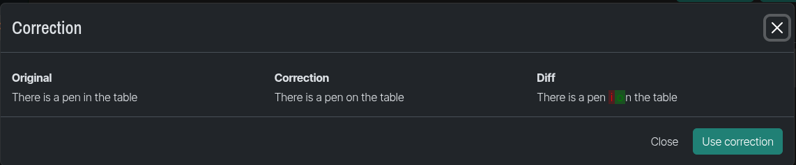

**Summarizations, Image Vision & Generation:**
Detailed in the [Baton AI In-Depth](#baton-ai-in-depth) section.

### Menu Configuration

Customize the sidebar via `BATON['MENU']`.

**Item Types:**

* `title`: Section header.
  * `label`, `apps` (optional), `perms` (optional), `children` (optional), `default_open` (optional), `icon` (optional Material Symbol).
* `app`: Links to a Django app.
  * `name` (lowercase app label), `label` (optional), `icon` (optional), `models` (optional tuple to customize model list), `default_open` (optional).
* `model`: Links to a model's changelist.
  * `name` (lowercase model name), `app` (lowercase app label), `label` (optional), `icon` (optional).
* `free`: Custom link.
  * `label`, `url`, `icon` (optional), `perms` (optional), `re` (optional regex for active highlighting), `children` (optional), `default_open` (optional).

> Children of items that themselves have children are ignored.

### Search Field Configuration

Add an autocomplete search field to the sidebar .

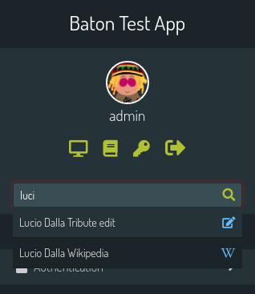

```python
'SEARCH_FIELD': {
    'label': 'Search contents...', # Placeholder
    'url': '/api/admin_search/',   # Your search API endpoint
}
```

Your API at `url` receives a `text` GET parameter and should return JSON:

```json
{
    "length": 1,
    "data": [
        { "label": "Search Result Label", "url": "/admin/path/to/item/", "icon": "search" }
    ]
}
```

Example Django view for the search API:

```python
# views.py
from django.http import JsonResponse
from django.contrib.admin.views.decorators import staff_member_required
# from myapp.models import YourModel # Your model

@staff_member_required
def admin_search_api(request):
    text = request.GET.get('text', None)
    response_data = []
    # Implement your search logic here
    # Example:
    # if text:
    #     items = YourModel.objects.filter(title__icontains=text)[:10]
    #     for item in items:
    #         response_data.append({
    #             'label': str(item),
    #             'url': f'/admin/myapp/yourmodel/{item.id}/change/', # Adjust URL
    #             'icon': 'article', # Material Symbol name
    #         })
    return JsonResponse({'length': len(response_data), 'data': response_data})
```

## 🤖 Baton AI In-Depth

AI features require `BATON_CLIENT_ID` and `BATON_CLIENT_SECRET`. See [AI Configuration](#ai-configuration) for model selection.

### Automatic Translations

If `ENABLE_TRANSLATIONS` is `True` and `django-modeltranslation` is used, a "Translate" button appears on forms with translatable fields. Supports default fields and CKEditor. See [AI Hooks](#ai-hooks) for other editors.

### Corrections

If `ENABLE_CORRECTIONS` is `True`, an icon near text fields (matching `CORRECTION_SELECTORS`) and CKEditor fields triggers AI correction. Differences are shown in a modal.

### Text Summarization

Define `baton_summarize_fields` in your `ModelAdmin`:

```python
# admin.py
class MyModelAdmin(admin.ModelAdmin):
    # ...
    baton_summarize_fields = {
        "source_field_name_it": [{ # e.g., 'body_it'
            "target": "target_field_name_it", # e.g., 'summary_it'
            "words": 140, # Approximate
            "useBulletedList": True,
            "language": "it", # Optional, defaults to Django's current language
        },
        # ... more targets for the same source field ...
        ],
    }
```

Buttons appear near the source field to generate summaries for target fields. Parameters (`words`, `useBulletedList`) can be edited in the UI. Supports default fields and CKEditor. See [AI Hooks](#ai-hooks).

### Image Generation

Use `BatonAiImageField` in your model:

```python
# models.py
from baton.fields import BatonAiImageField
from django.db import models
from django.utils.translation import gettext_lazy as _

class MyMediaModel(models.Model):
    ai_generated_image = BatonAiImageField(
        verbose_name=_("AI Generated Image"),
        upload_to="ai_images/",
        subject_location_field='image_subject_location', # Optional: for subject focus
        alt_field="image_alt_text" # Optional: for AI-generated alt text (see Image Vision)
    )
    image_subject_location = models.CharField(max_length=7, default="50,50", blank=True)
    image_alt_text = models.CharField(max_length=255, blank=True)
```

A button near the field opens a modal to generate images from text prompts.
Alternatively, for standard `ImageField`s, add generation capability with JavaScript:

```html
<script>
    Baton.AI.addImageGeneration('{{ widget.name }}'); // widget.name of the ImageField
</script>
```

Integrates `django-subject-imagefield` features for subject location. Configure preview width via `IMAGE_PREVIEW_WIDTH` in `BATON` settings.

### Image Vision

Generate `alt` text for images.

1. **Using `BatonAiImageField`**:
    Set `alt_field`, `alt_chars` (optional), `alt_language` (optional) attributes on the field. Works primarily for images within inlines.

    ```python
    # models.py
    image = BatonAiImageField(upload_to="news/", alt_field="image_alt_text", alt_chars=100)
    image_alt_text = models.CharField(max_length=150, blank=True)
    ```

2. **Using `ModelAdmin` configuration**:
    Define `baton_vision_fields` in your `ModelAdmin`:

    ```python
    # admin.py
    class MyModelAdmin(admin.ModelAdmin):
        # ...
        baton_vision_fields = {
            #id_form-0-image": [{ // CSS selector for the image field (can target inlines)
            "#id_image_field_name": [{ // Key must be a CSS selector targeting the image input or its preview
                "target": "name_of_alt_text_field", // Name of a CharField in the same model/form
                "chars": 80,                            // Optional: max characters (default 100)
                "language": "en",                       // Optional: language for description
            }],
        }
    ```

    A button appears near the specified image field. Clicking it populates the `target` field with the AI-generated description.

### Stats Widget

Display a widget showing AI feature usage statistics on your admin dashboard. Add the following to your admin index template (typically `admin/index.html` that you override):

```django



```

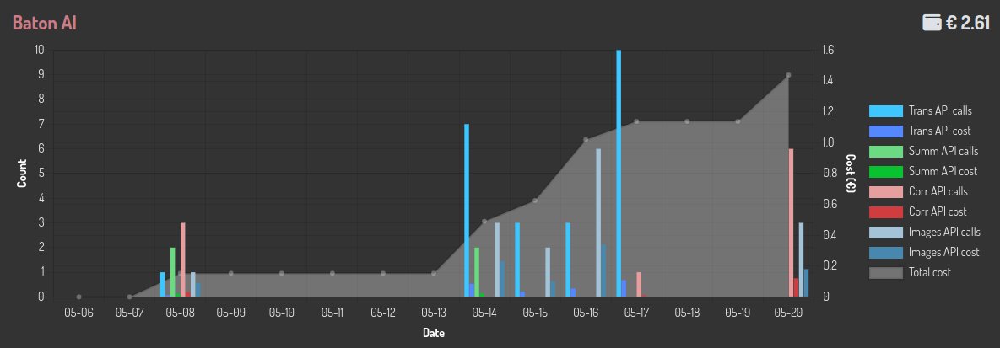

### AI Hooks

Django Baton's AI features interact with form fields to get and set values. Native HTML inputs, textareas, and fields managed by `django-ckeditor` are supported by default. To add support for other WYSIWYG editors or custom input widgets, you need to define JavaScript hooks.

Place these hook definitions in your `admin/base_site.html` template, **before** the `` script tag:

```html
<script src=""></script> {# Ensure Baton's main JS is loaded first #}
<script>
(function () {
    // Hook to get a list of all field IDs managed by your custom editor.
    // Should return an array of strings (field IDs).
    Baton.AI.getEditorFieldsHook = function () {
        // Example for a hypothetical 'MyEditor':
        // if (window.MyEditor && typeof window.MyEditor.getAllInstanceIds === 'function') {
        //   return window.MyEditor.getAllInstanceIds();
        // }
        return []; // Implement for your specific editor
    };

    // Hook to get the content of a specific editor instance by its field ID.
    // Should return the string content or null/undefined if fieldId is not an editor field.
    Baton.AI.getEditorFieldValueHook = function (fieldId) {
        // Example for 'MyEditor':
        // if (window.MyEditor && typeof window.MyEditor.getInstance === 'function') {
        //   const editorInstance = window.MyEditor.getInstance(fieldId);
        //   return editorInstance ? editorInstance.getContent() : null;
        // }
        return null; // Implement for your specific editor
    };

    // Hook to set the content of a specific editor instance.
    // Should return true if the fieldId corresponds to an editor and value was set, false otherwise.
    Baton.AI.setEditorFieldValueHook = function (fieldId, value) {
        // Example for 'MyEditor':
        // if (window.MyEditor && typeof window.MyEditor.getInstance === 'function') {
        //   const editorInstance = window.MyEditor.getInstance(fieldId);
        //   if (editorInstance) {
        //     editorInstance.setContent(value);
        //     return true;
        //   }
        // }
        return false; // Implement for your specific editor
    };

    // Hook to display a "correct" icon (checkmark) near an editor field.
    // `iconElement` is a DOM element (the icon) provided by Baton.
    // Should return true if successful, false otherwise.
    Baton.AI.setEditorFieldCorrectHook = function (fieldId, iconElement) {
        // Example for 'MyEditor':
        // if (window.MyEditor && typeof window.MyEditor.getInstance === 'function') {
        //   const editorInstance = window.MyEditor.getInstance(fieldId);
        //   if (editorInstance && editorInstance.getContainer()) {
        //     // Insert iconElement after the editor's container
        //     editorInstance.getContainer().parentNode.insertBefore(iconElement, editorInstance.getContainer().nextSibling);
        //     return true;
        //   }
        // }
        return false; // Implement for your specific editor
    };
})();
</script>
<script src=""></script>
```

## 📄 Page Detection

Baton identifies current admin page types (e.g., `change_form`, `changelist`) using regex on `location.pathname`. You can customize this for custom URLs. Define `Baton.detectPageHook` in `admin/base_site.html` **before** `init_baton.js`:

```html
{{ conf|json_script:"baton-config" }} {# Assuming conf is your BATON settings dict passed to template #}
<script src=""></script>
<script>
(function () {
    Baton.detectPageHook = function (defaultDetectFn) {
        if (/newschange/.test(location.pathname)) { // Example: custom URL part
            return 'change_form';
        }
        return defaultDetectFn(); // Fallback to Baton's default detection
    };
})();
</script>
<script src=""></script>
```

**Available Page Types:** `dashboard`, `admindocs`, `login`, `logout`, `password_change`, `password_change_success`, `add_form`, `change_form`, `changelist`, `filer`, `default`.

## 📡 Signals

Baton emits JavaScript events using its dispatcher. Register listeners **before** `Baton.init()`.

```html
<script>
(function ($) { // jQuery is available as $ via Baton
    Baton.Dispatcher.register('onReady', function () { console.log('BATON IS READY'); });
    Baton.Dispatcher.register('onMenuReady', function () { console.log('BATON MENU IS READY'); });
    Baton.Dispatcher.register('onNavbarReady', function () { console.log('BATON NAVBAR IS READY'); });
    Baton.Dispatcher.register('onTabsReady', function () { console.log('BATON TABS ARE READY'); });
    Baton.Dispatcher.register('onTabChanged', function (evtName, tabData) { console.log('BATON TAB CHANGED', tabData); });
    Baton.Dispatcher.register('onMenuError', function () { console.error('BATON MENU FAILED TO LOAD'); });
})(Baton.jQuery); // Pass Baton's jQuery instance
</script>
<script src=""></script>
```

**Events:**

* `onReady`: Baton JS fully initialized.
* `onNavbarReady`: Navbar rendered.
* `onMenuReady`: Menu rendered (often last, due to async fetch).
* `onTabsReady`: Form tabs rendered.
* `onTabChanged`: Active form tab changed.
* `onMenuError`: Menu content failed to load.

## 🧩 JS Utilities

Baton exports JS modules for use in your custom admin scripts.

### Dispatcher

A singleton Mediator pattern implementation.

```javascript
// Register callback
Baton.Dispatcher.register('myCustomEvent', function (eventName, eventData) {
    console.log('Event ' + eventName + ' fired with data: ', eventData);
});

// Emit event
Baton.Dispatcher.emit('myCustomEvent', { message: 'Hello Baton!' });
```

### Modal

Create Bootstrap modals programmatically.
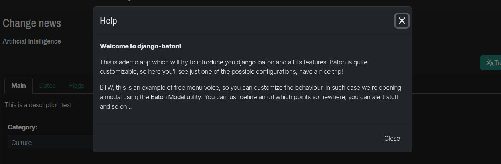

```javascript
// Example Modal Configuration Object:
// let config = {
//     title: 'My modal title',
//     subtitle: 'My subtitle', // optional
//     content: '<p>my html content</p>', // alternative to url
//     url: '/my/url', // fetches content via AJAX; alternative to content.
//     hideFooter: false, // optional
//     showBackBtn: false, // optional, show a back button
//     backBtnCb: function () {}, // optional, back button click callback
//     actionBtnLabel: 'save', // optional, default 'save'
//     actionBtnCb: null, // optional, action button callback
//     onUrlLoaded: function () {}, // optional, callback after AJAX content loads
//     size: 'lg', // optional: sm, md, lg, xl
//     onClose: function () {} // optional, callback when modal closes
// };

let myModal = new Baton.Modal({
    title: 'My Modal Title',
    content: '<p>Some HTML content for the modal body.</p>',
    size: 'lg' // Example size
});

myModal.open();
// myModal.close();
// myModal.toggle();
// myModal.update({ title: 'New Modal Title', content: '<p>Updated content here.</p>' });
```

## 🌐 JS Translations

Baton includes `en` and `it` translations for its JS messages. It detects user locale from `<html>` tag's `lang` attribute. Add/override translations by defining `Baton.translations` **before** `Baton.init()`:

```javascript
// Place in admin/base_site.html before init_baton.js
Baton.translations = {
  // Default English, override or add other locales
  en: {
    unsavedChangesAlert: 'You have some unsaved changes.',
    uploading: 'Uploading...',
    filter: 'Filter',
    close: 'Close',
    save: 'Save',
    search: 'Search',
    cannotCopyToClipboardMessage: 'Cannot copy to clipboard, please do it manually: Ctrl+C, Enter',
    retrieveDataError: 'There was an error retrieving the data',
    lightTheme: 'Light theme',
    darkTheme: 'Dark theme'
  },
  it: { // Example for Italian
    unsavedChangesAlert: 'Ci sono modifiche non salvate.',
    uploading: 'Caricamento...',
    // ... other Italian translations
  }
  // Add other locales as needed, e.g. 'es': { ... }
};
```

Baton defaults to `en` if a translation for the user's locale is not found.

## 📊 List Filters

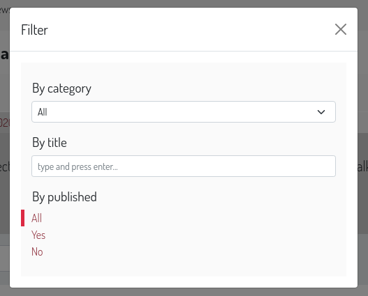

### Input Text Filters

Create text input filters in your `ModelAdmin`. (Adapted from [this article](https://medium.com/@hakibenita/how-to-add-a-text-filter-to-django-admin-5d1db93772d8)).

```python
# admin.py
from baton.admin import InputFilter
from django.contrib import admin # If not already imported

class MyModelIdFilter(InputFilter):
    parameter_name = 'id' # URL query parameter
    title = 'ID'          # Display title for the filter

    def queryset(self, request, queryset):
        if self.value() is not None:
            # Ensure value is treated as expected type, e.g., int for ID
            try:
                search_term = int(self.value())
                return queryset.filter(id=search_term)
            except ValueError:
                return queryset.none() # Or handle error appropriately
        return queryset

class MyModelAdmin(admin.ModelAdmin):
    list_display = ('id', 'name', 'other_field') # Example
    list_filter = (MyModelIdFilter, 'other_field')
```

### Dropdown Filters

Provides dropdown versions of standard Django admin list filters if a filter has at least 3 options. (Inspired by `django-admin-list-filter-dropdown`).

| Django Admin Filter      | Baton Equivalent            |
| :----------------------- | :-------------------------- |
| `SimpleListFilter`       | `SimpleDropdownFilter`      |
| `AllValuesFieldListFilter` | `DropdownFilter`            |
| `ChoicesFieldListFilter` | `ChoicesDropdownFilter`     |
| `RelatedFieldListFilter` | `RelatedDropdownFilter`     |
| `RelatedOnlyFieldListFilter`| `RelatedOnlyDropdownFilter` |

Usage:

```python
# admin.py
from baton.admin import DropdownFilter, RelatedDropdownFilter, ChoicesDropdownFilter
# from myapp.models import MyModel, MyRelatedModel # Your models

class MyModelAdmin(admin.ModelAdmin):
    # list_display = ('name', 'char_field', 'choice_field', 'foreign_key_field') # Example
    list_filter = (
        ('char_field', DropdownFilter), # For CharField, TextField etc.
        ('choice_field', ChoicesDropdownFilter), # For fields with choices
        ('foreign_key_field', RelatedDropdownFilter), # For ForeignKey, ManyToManyField
    )
```

### Multiple Choice Filters

Filter on multiple options for a field.

```python
# admin.py
from baton.admin import MultipleChoiceListFilter
# from myapp.models import News # Assuming News model with Status choices

class NewsStatusListFilter(MultipleChoiceListFilter):
    title = 'Status'
    parameter_name = 'status__in' # Query parameter for __in lookup

    def lookups(self, request, model_admin):
        # Example assuming News.Status has .choices attribute
        # return News.Status.choices
        return (('draft', 'Draft'), ('published', 'Published'), ('archived', 'Archived')) # Example choices

class NewsAdmin(admin.ModelAdmin):
    # list_display = ('title', 'status') # Example
    list_filter = (NewsStatusListFilter, 'publication_date')
```

## ➕ Changelist Includes
>
> Requires browser support for HTML `<template>` tags.

Embed custom templates within the changelist page.

```python
# admin.py
# from django.contrib import admin # If using @admin.register
# from myapp.models import News # Your model

# @admin.register(News)
class NewsAdmin(admin.ModelAdmin):
    # ...
    baton_cl_includes = [
        ('myapp/admin_includes/cl_top_banner.html', 'top'),
        ('myapp/admin_includes/cl_below_table.html', 'below'),
    ]
```

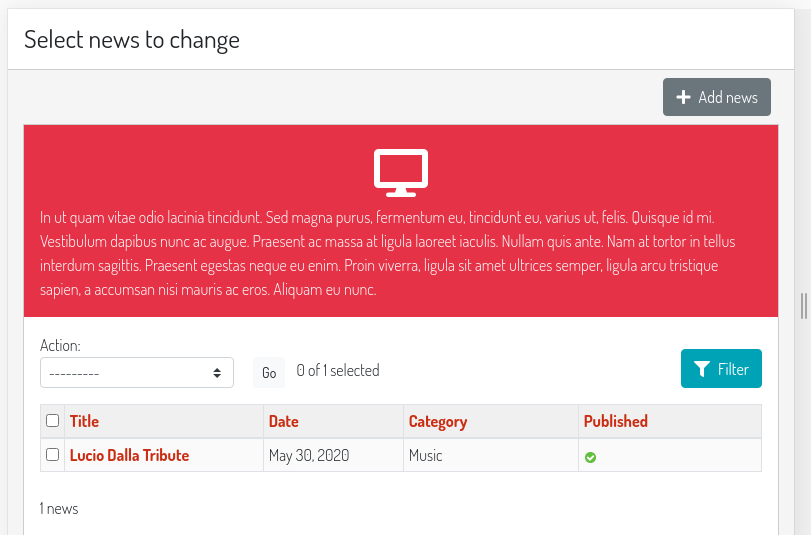

**Positions:**

| Position | Description                                     |
| :------- | :---------------------------------------------- |
| `top`    | Inside changelist form, at the top.             |
| `bottom` | Inside changelist form, at the bottom.          |
| `above`  | Above the entire changelist form.               |
| `below`  | Below the entire changelist form.               |

Changelist view context variables are available in your included template.

## ☰ Changelist Filters Includes
>
> Requires browser support for HTML `<template>` tags.

Embed custom templates within the changelist filter container.

```python
# admin.py
class NewsAdmin(admin.ModelAdmin):
    # ...
    baton_cl_filters_includes = [
        ('myapp/admin_includes/filters_top_custom_filter.html', 'top'),
        ('myapp/admin_includes/filters_bottom_info.html', 'bottom'),
    ]
```

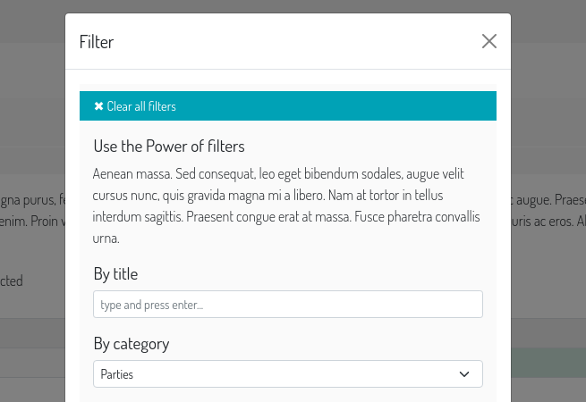

**Positions:**

| Position | Description                                          |
| :------- | :--------------------------------------------------- |
| `top`    | Inside filter container, at the top.                 |
| `bottom` | Inside filter container, at the bottom.              |

Changelist view context variables are available.

## ↔️ Changelist Row Attributes
>
> Requires browser support for HTML `<template>` tags.

Add HTML attributes (classes, `data-*`, `title`, etc.) to elements in the changelist table (rows, cells).
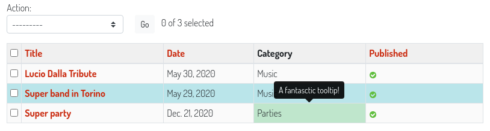

1. Define `baton_cl_rows_attributes` method in your `ModelAdmin`. It takes `request` and `cl` (changelist instance) as arguments.
2. Return a JSON string dictionary. Keys usually match instance IDs. Values are dicts specifying attributes and selectors.

```python
# admin.py
import json
from django.utils.safestring import mark_safe
# from myapp.models import News # Assuming News model

class NewsAdmin(admin.ModelAdmin):
    list_display = ('title', 'get_category_display', 'status') # Use the method name

    def get_category_display(self, instance):
        # Helper for targeting specific cells if needed by selector
        if instance.category: # Check if category exists
            return mark_safe(f'<span class="category-span-{instance.category.id}">{instance.category.name}</span>')
        return "-" # Fallback if no category
    get_category_display.short_description = 'Category'
    get_category_display.admin_order_field = 'category' # Optional: if you want to allow ordering

    def baton_cl_rows_attributes(self, request, cl):
        data = {}
        # Example 1: Add 'table-info' class to rows of news items in category ID 2
        for news_item in cl.queryset.filter(category__id=2):
            data[str(news_item.id)] = { # Ensure key is string for JSON
                'class': 'table-info',
            }

        # Example 2: More complex - target a specific cell for a specific news item
        # This example assumes you want to style a cell for a news item with ID=1 and category_id=1
        try:
            news_to_style = cl.queryset.get(id=1, category__id=1) # More specific lookup
            data[f"customkey_cell_{news_to_style.id}"] = { # Key can be arbitrary if selector is specific
                'class': 'table-success font-weight-bold', # Example: bold success
                'data-category-name': news_to_style.category.name if news_to_style.category else '',
                'title': f'Special: {news_to_style.title}',
                # This selector targets the span created by get_category_display
                # It assumes the changelist renders the output of get_category_display in a cell
                'selector': f'#result_list tr input[name=_selected_action][value="{news_to_style.pk}"] ~ td .category-span-{news_to_style.category_id}',
                'getParent': 'td', # Applies attributes to the parent <td> of the found span
            }
        except cl.model.DoesNotExist: # Or your specific model DoesNotExist
            pass # Item not found, or doesn't match criteria

        return json.dumps(data)
```

**Rules for the returned dictionary values:**

* **Keys:** Typically the primary key of the model instance (as a string). If using a custom `selector` that doesn't rely on the instance ID, the key can be any unique string.
* **`selector`** (optional): CSS selector to find the target element.
  * Default: `'#result_list tr input[name=_selected_action][value="' + key + '"]'` (targets the checkbox for the row of instance `key`). This works if `actions` are enabled.
* **`getParent`** (optional):
  * Default: `'tr'` (attributes are applied to the row).
  * You can specify another selector (e.g., `'td'`, `'.field-my_field'`) to find a parent of the element matched by `selector`.
  * Set to `false` (boolean, not string) or an empty string to apply attributes directly to the element matched by `selector`.
* **Other keys:** Treated as HTML attributes to be added to the target element.

## 📑 Form Tabs

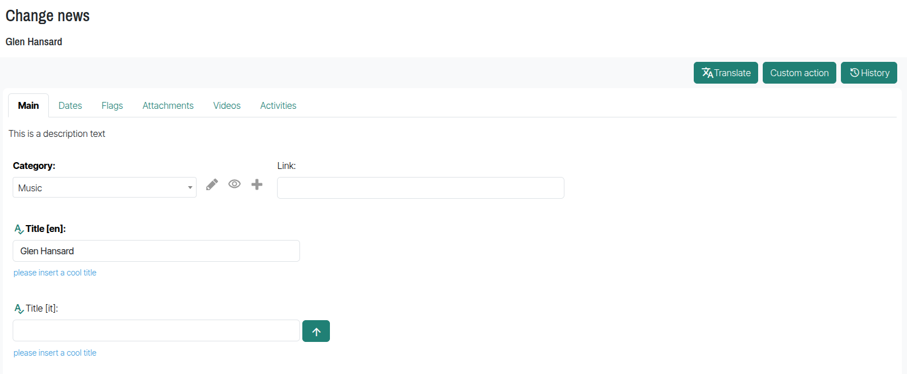
Organize your admin forms with tabs for fieldsets and inlines. Titles are derived automatically.

**Configuration (in `ModelAdmin.fieldsets` or `ModelAdmin.inlines`):**

```python
# admin.py
# from myapp.models import Attribute, Feature # Your models

# class AttributeInline(admin.StackedInline):
#     model = Attribute # Your model
#     extra = 1

# class FeatureInline(admin.StackedInline):
#     model = Feature # Your model
#     extra = 1

class ItemAdmin(admin.ModelAdmin):
    # list_display = ('label', 'description', 'main_feature')
    # inlines = [AttributeInline, FeatureInline] # Order of inlines matters for grouping

    fieldsets = (
        ('Main Info', { # This fieldset will be the first tab (or part of it)
            'fields': ('label', 'description'),
            'classes': ('baton-tabs-init', 'order-0', 'baton-tab-group-main--inline-attribute'),
            # 'baton-tabs-init': REQUIRED on the first fieldset to enable tabs.
            # 'order-X': (Optional) Defines the tab order for this fieldset. Default 0.
            # 'baton-tab-inline-MODELNAME': Creates a tab for the inline 'attribute' (lowercase model name).
            # 'baton-tab-fs-CUSTOMNAME': Creates a tab for this fieldset (Main Info -> content_tab).
            # 'baton-tab-group-GROUPNAME--item1type-ITEMNAME--item2type-ITEMNAME': Creates a group tab.
            #    GROUPNAME is arbitrary. ITEMNAME can be fs-FIELDSETNAME or inline-INLINEMODELNAME.
            #    Example: 'baton-tab-group-overview--fs-main_info--inline-attribute'
            #    This creates a group tab named "Overview" containing the "Main Info" fieldset and the "Attribute" inline.
            'description': 'This is the main information for the item.'
        }),
        ('Content Details', {
            'fields': ('text', ),
            'classes': ('baton-tab-fs-content', ), # This fieldset becomes a tab named "Content"
            'description': 'Detailed content for the item.'
        }),
        ('Technical Specs', {
            'fields': ('main_feature', ),
            # This fieldset is part of a group tab defined in the "Main Info" fieldset:
            # e.g. 'baton-tab-group-main--inline-attribute--fs-tech--inline-feature' in 'Main Info' would group this.
            'classes': ('baton-tab-fs-tech', ),
            'description': 'Technical specifications and features.'
        }),
    )
```

**Rules for Tab Classes (applied to a fieldset's `classes` tuple):**

* **`baton-tabs-init`**: **Required** on the *first* fieldset definition to activate the tabbing system.
* **`order-X`**: (Optional, on the first fieldset) Sets the display order of the tab generated by the first fieldset itself. `X` is a number (e.g., `order-0`, `order-1`).
* **`baton-tab-inline-MODELNAME`**: Creates a separate tab for the inline whose model is `MODELNAME` (lowercase). If you used `related_name` for the inline, use `baton-tab-inline-RELATEDNAME`.
* **`baton-tab-fs-CUSTOMNAME`**: Creates a separate tab for the fieldset that *also* has the class `tab-fs-CUSTOMNAME`. `CUSTOMNAME` is an arbitrary name you choose.
* **`baton-tab-group-GROUPNAME--item1type-ITEM1NAME--item2type-ITEM2NAME...`**: Creates a group tab.
  * `GROUPNAME` is an arbitrary name for your tab.
  * `itemXtype` is either `fs` (for fieldset) or `inline`.
  * `ITEMXNAME` is your `CUSTOMNAME` (for fieldsets) or `MODELNAME`/`RELATEDNAME` (for inlines).
  * Example: `baton-tab-group-overview--fs-main_content--inline-attributes`
* Fieldsets without a `baton-tab-fs-*` class that are *not* part of a group will be appended to the first tab.
* To make a fieldset *always visible* (not part of any tab), add the class `tab-fs-none` to that fieldset.

**Other Tab Features:**

* If a form field has an error, the first tab containing that field is automatically opened.
* Deep link to a tab by adding its hash to the URL (e.g., `#inline-feature`, `#fs-content`, `#group-overview--fs-main_content--inline-attributes`). The hash is derived from the tab class names.

## 📎 Form Includes
>
> Requires browser support for HTML `<template>` tags.

Embed custom templates near specific fields in change forms.

```python
# admin.py
class NewsAdmin(admin.ModelAdmin):
    # ...
    baton_form_includes = [
        ('myapp/admin_includes/datetime_helper.html', 'publication_date', 'top'),
        ('myapp/admin_includes/content_notes.html', 'body_content', 'above'),
        ('myapp/admin_includes/field_icon.html', 'title', 'right'),
    ]
```

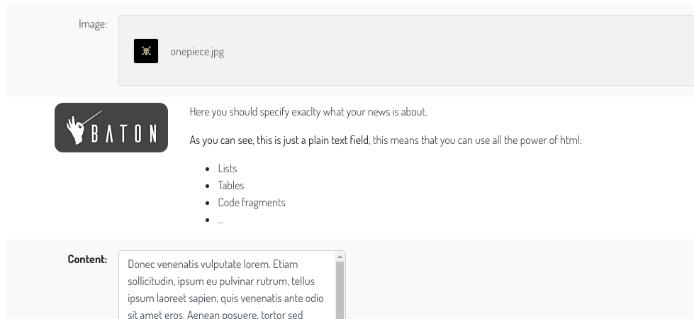

**Positions:**

| Position | Description                                  |
| :------- | :------------------------------------------- |
| `top`    | Inside the field's form row, at the top.     |
| `bottom` | Inside the field's form row, at the bottom.  |
| `above`  | Above the field's form row.                  |
| `below`  | Below the field's form row.                  |
| `right`  | Inline, to the right of the input field.     |

The `{{ original }}` object (the model instance) is available in your included template. Works with tabs.

**Object Tools Includes:**
Inject templates into the object tools bar (top right of change form). Templates are injected inside a `<ul>`.

```python
# admin.py
class NewsAdmin(admin.ModelAdmin):
    # ...
    baton_form_object_tools_include = ('myapp/admin_includes/custom_object_action.html', 'left') # or 'right'
```

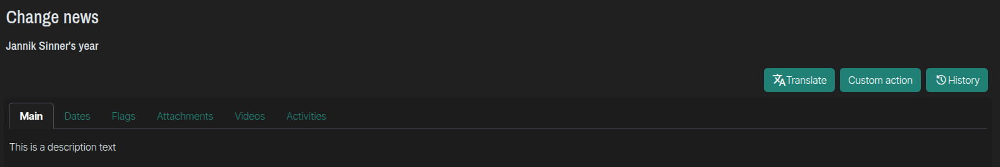

## 🤏 Collapsable Stacked Inlines

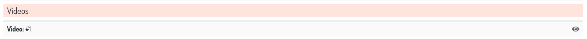
Make individual entries in `admin.StackedInline` collapsable.

Add `collapse-entry` to the inline's `classes`:

```python
# admin.py
class VideoInline(admin.StackedInline):
    # model = Video # Your model
    extra = 1
    classes = ('collapse-entry', ) # Can be combined with Django's 'collapse'
```

To have the first entry expanded by default:

```python
# admin.py
class VideoInline(admin.StackedInline):
    # model = Video # Your model
    extra = 1
    classes = ('collapse-entry', 'expand-first')
```

## 🎨 Themes & Customization

Easily customize Baton's appearance:

1. **CSS Variables:**
    Create a `baton/css/root.css` file in one of your app's static directories (ensure this app is listed *before* `baton` in `INSTALLED_APPS`). Override any CSS variables defined in Baton's default [root.css](https://github.com/otto-torino/django-baton/tree/master/baton/static/baton/css/root.css).
    Example:

    ```css
    /* myapp/static/baton/css/root.css */
    :root {
      --bs-primary: #FF6347;
      --bs-primary-rgb: 255,99,71;
      --baton-sidebar-active-bg: #FF6347;
    }
    ```

2. **Admin Themes:**
    Create and manage themes directly from the admin site at `/admin/baton/batontheme/`. Only one theme can be active. Its CSS content (which should define CSS variables) will override the `baton/css/root.css` file.
    > **Caution:** Theme content is marked safe and injected as-is. Be careful.
    > ✨ Find ready-to-use themes at [django-baton-themes](https://github.com/otto-torino/django-baton-themes).

3. **Heavy Customization (Recompiling JS App):**
    For changes to primary/secondary Bootstrap colors or extensive modifications, you can recompile Baton's JavaScript application.
    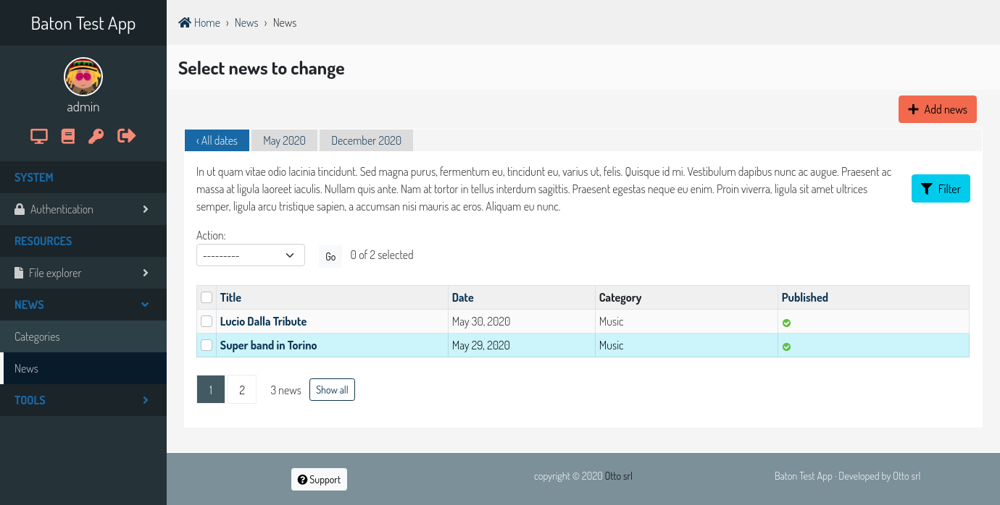
    1. Clone `django-baton`.
    2. Navigate to `django-baton/baton/static/baton/app/`.
    3. Run `npm install`.
    4. Edit `src/styles/_variables.scss` (and other SCSS/JS files as needed).
    5. Run `npm run compile`.
    6. Copy the compiled `dist/baton.min.js` to your project: `YOUR_APP/static/baton/app/dist/`.
    7. Ensure `YOUR_APP` is listed *before* `baton` in `INSTALLED_APPS`.

    For live development with automatic recompilation:
    1. `cd django-baton/baton/static/baton/app/`
    2. Run `npm run dev:baton` (starts Webpack dev server, usually on `http://localhost:8080`).
    3. In your project's `admin/base_site.html` (you might need to override it), change the script source to point to the dev server:

        ```html
        {# <script src=""></script> #}
        <script src="http://localhost:8080/static/baton/app/dist/baton.min.js"></script>
        ```

    Now, changes in the JS app will auto-update, just refresh your Django admin page.

## 🧪 Tests

Baton includes unit and end-to-end (e2e) tests using Selenium. To run e2e tests, ensure the test application (found in the `testapp` directory of the Baton repository) is running on `localhost:8000`.

## 💻 Development

To contribute or develop locally:

1. **Set up the test app:**

    ```bash
    cd testapp
    python3 -m venv .virtualenv
    source .virtualenv/bin/activate # On Windows: .virtualenv\Scripts\activate
    cd app
    pip install -r requirements.txt
    python manage.py migrate
    python manage.py createsuperuser # If needed
    python manage.py runserver
    ```

    (Default login after `createsuperuser`: `admin` / `admin`, or as you defined).

2. **Enable live JS recompilation for development:**
    * In `testapp/app/templates/admin/base_site.html`, switch the script source to Webpack dev server:

        ```html
        {# <script src=""></script> #}
        <script src="http://localhost:8080/static/baton/app/dist/baton.min.js"></script>
        ```

    * In a new terminal, navigate to Baton's frontend app directory and start the dev server:

        ```bash
        cd /path/to/your/django-baton/baton/static/baton/app/
        npm install
        npm run dev # For continuous development, watches for changes
        ```

    Changes to Baton's frontend app will now auto-recompile. Refresh your browser to see them.

### Commands

Install `invoke` and `sphinx_rtd_theme` in your Python environment for documentation generation:

```bash
pip install invoke sphinx_rtd_theme
```

To generate documentation locally (from the root directory of the `django-baton` repository):

```bash
invoke docs
```

## 🤝 Contributing

Please read [CONTRIBUTING.md](CONTRIBUTING.md) for details on our code of conduct and the process for submitting pull requests. We welcome contributions!

## 🌟 Star History

[](https://star-history.com/#otto-torino/django-baton&Date)
