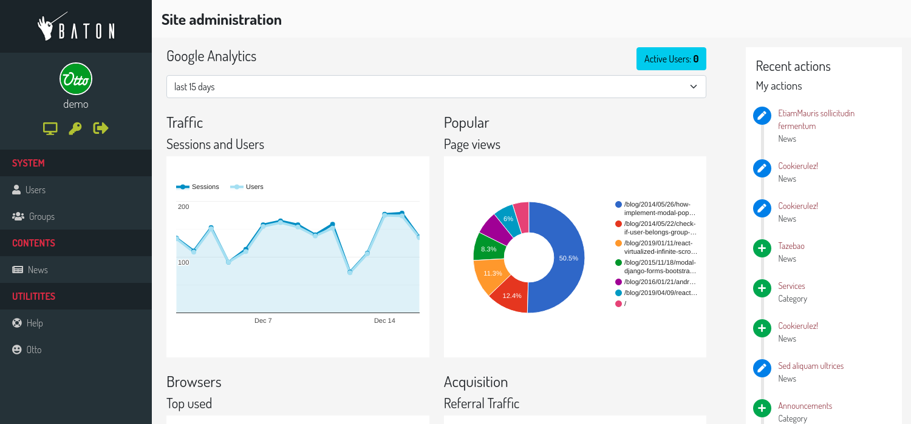
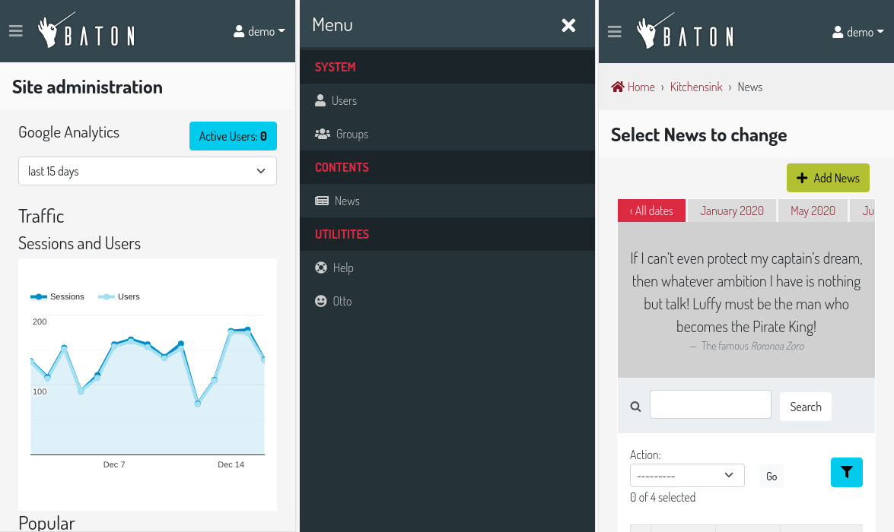
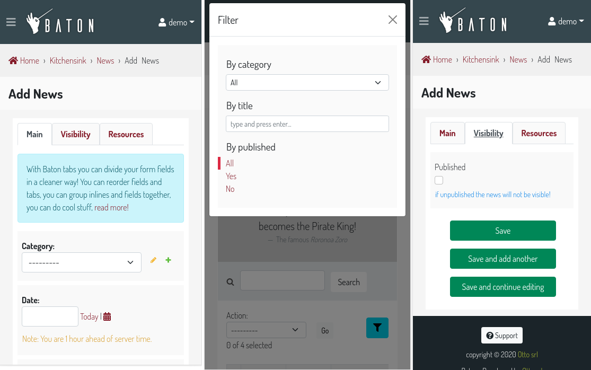
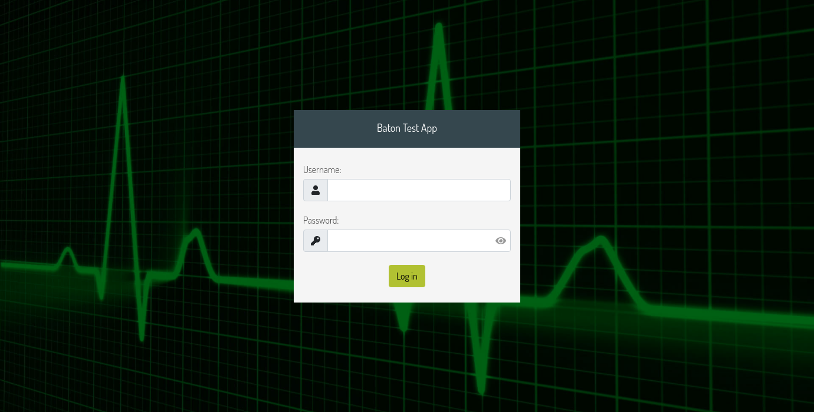
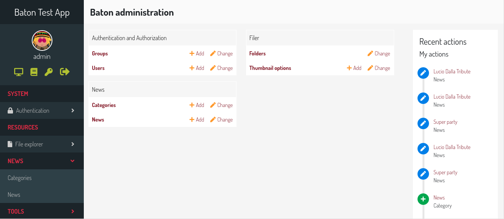
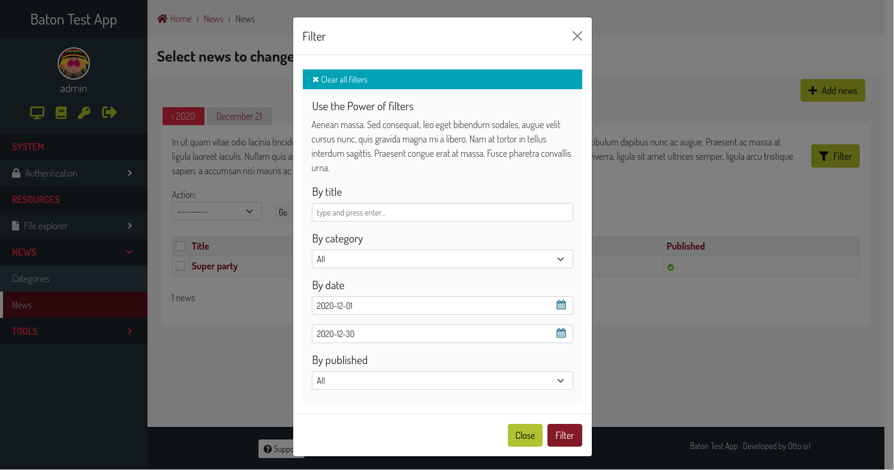

# django-baton


[](https://travis-ci.com/github/otto-torino/django-baton)

[](https://pepy.tech/project/django-baton)

A cool, modern and responsive django admin application based on bootstrap 5

Documentation: [readthedocs](http://django-baton.readthedocs.io/)

---
**Live Demo**

Now you can try django-baton using the new shining live demo!
Login with user `demo` and password `demo`

[https://django-baton-demo.herokuapp.com/](https://django-baton-demo.herokuapp.com/)

---



## Table of contents

- [Features](#features)
- [Installation](#installation)
- [Configuration](#configuration)
    - [Menu](#configuration-menu)
    - [Search Field](#configuration-search-field)
    - [Analytics](#configuration-analytics)
- [Page Detection](#page-detection)
- [Signals](#signals)
- [Js Utilities](#js-utilities)
- [Js Translations](#js-translations)
- [List Filters](#list-filters)
- [Changelist Includes](#changelist-includes)
- [Changelist Filters Includes](#changelist-filters-includes)
- [Changelist Row Attributes](#changelist-row-attributes)
- [Form Tabs](#form-tabs)
- [Form Includes](#form-includes)
- [Collapsable stacked inlines entries](#collapsable-stackedinline)
- [Customization](#customization)
- [Tests](#tests)
- [Contributing](#contributing)
- [Screenshots](#screenshots)

## <a name="features"></a>Features

Supports Django >= 2.1. For older versions of Django, please use django-baton@1.13.2.

This application was written with one concept in mind: overwrite as few django templates as possible.
Everything is styled through CSS and when required, JS is used.

- Based on Bootstrap 5 and FontAwesome Free 5
- Fully responsive
- Custom and flexible sidebar menu
- Configurable search field
- Text input filters and dropdown list filters facilities
- Form tabs out of the box
- Easy way to include templates in the change form and change list pages
- Easy way to add attributes to change list table rows/cells
- Collapsable stacked inline entries
- Lazy loading of uploaded images
- Optional display of changelist filters in a modal
- Optional use of changelist filters as a form (combine some filters at once and perform the search action)
- Optional index page filled with google analytics widgets
- Customization available for recompiling the js app provided
- IT translations provided

The following packages are required to manage the Google Analytics index:

- google-auth
- google-auth-httplib2
- google-api-python-client
- requests

Baton is based on the following frontend technologies:

- Bootstrap 5
- FontAwesome 5 (solid and brands)

Flexbox is used to accomplish responsiveness. jQuery is used for DOM manipulations.

All JS, fonts and CSS are compiled, and produce a single JS file which is included in the `base_site` template.

A custom menu is provided, the menu is rendered through JS, and data is fetched in JSON format through an AJAX request.

## <a name="installation"></a>Installation

Install the last stable release

    $ pip install django-baton

> :information_source: In order to use the Google Analytics index, install baton along the optional dependencies with `$ pip install django-baton[analytics]`

or clone the repo inside your project

    $ git clone https://github.com/otto-torino/django-baton.git

Add `baton` and `baton.autodiscover` to your `INSTALLED_APPS`:

``` python
INSTALLED_APPS = (
    # ...
    'baton',
    'django.contrib.admin',
    # ... (place baton.autodiscover at the very end)
    'baton.autodiscover',
)
```

Replace `django.contrib.admin` in your project urls, and add baton urls:

``` python
# from django.contrib import admin
from baton.autodiscover import admin
from django.urls import path, include

urlpatterns = [
    path('admin/', admin.site.urls),
    path('baton/', include('baton.urls')),

]
```

If you get a "__No crypto library available__" when using the Google Analytics index, install this package:

    $ pip install PyOpenSSL

### Why two installed apps?

Well, first `baton` has to be placed before the `django.contrib.admin` app, because it overrides 3 templates and resets all CSS.
The `baton.autodiscover` entry is needed as the last installed app in order to register all applications for the admin.
I decided to create a custom `AdminSite` class, to allow the customization of some variables the Django way (`site_header`, `index_title`, ...). I think it's a good approach to customize these vars instead of overwriting the orignal templates. The problem is that when creating a custom AdminSite, you have to register all the apps manualy. I didn't like
that so I wrote this `autodiscover` module which automatically registers all the apps registered with the Django's default AdminSite. For this to work, all the apps must be already registered so this app should be the last in `INSTALLED_APPS`.

## <a name="configuration"></a>Configuration

The configuration dictionary must be defined inside your settings:

``` python
BATON = {
    'SITE_HEADER': 'Baton',
    'SITE_TITLE': 'Baton',
    'INDEX_TITLE': 'Site administration',
    'SUPPORT_HREF': 'https://github.com/otto-torino/django-baton/issues',
    'COPYRIGHT': 'copyright © 2020 <a href="https://www.otto.to.it">Otto srl</a>', # noqa
    'POWERED_BY': '<a href="https://www.otto.to.it">Otto srl</a>',
    'CONFIRM_UNSAVED_CHANGES': True,
    'SHOW_MULTIPART_UPLOADING': True,
    'ENABLE_IMAGES_PREVIEW': True,
    'CHANGELIST_FILTERS_IN_MODAL': True,
    'CHANGELIST_FILTERS_ALWAYS_OPEN': False,
    'CHANGELIST_FILTERS_FORM': True,
    'MENU_ALWAYS_COLLAPSED': False,
    'MENU_TITLE': 'Menu',
    'MESSAGES_TOASTS': False,
    'GRAVATAR_DEFAULT_IMG': 'retro',
    'LOGIN_SPLASH': '/static/core/img/login-splash.png',
    'SEARCH_FIELD': {
        'label': 'Search contents...',
        'url': '/search/',
    },
    'MENU': (
        { 'type': 'title', 'label': 'main', 'apps': ('auth', ) },
        {
            'type': 'app',
            'name': 'auth',
            'label': 'Authentication',
            'icon': 'fa fa-lock',
            'models': (
                {
                    'name': 'user',
                    'label': 'Users'
                },
                {
                    'name': 'group',
                    'label': 'Groups'
                },
            )
        },
        { 'type': 'title', 'label': 'Contents', 'apps': ('flatpages', ) },
        { 'type': 'model', 'label': 'Pages', 'name': 'flatpage', 'app': 'flatpages' },
        { 'type': 'free', 'label': 'Custom Link', 'url': 'http://www.google.it', 'perms': ('flatpages.add_flatpage', 'auth.change_user') },
        { 'type': 'free', 'label': 'My parent voice', 'default_open': True, 'children': [
            { 'type': 'model', 'label': 'A Model', 'name': 'mymodelname', 'app': 'myapp' },
            { 'type': 'free', 'label': 'Another custom link', 'url': 'http://www.google.it' },
        ] },
    ),
    'ANALYTICS': {
        'CREDENTIALS': os.path.join(BASE_DIR, 'credentials.json'),
        'VIEW_ID': '12345678',
    }
}
```

- `SITE_HEADER`, `COPYRIGHT` and `POWERED_BY` are marked as safe, so you can include img tags and links.
- `SUPPORT_HREF` is the URL of the support link. For instance, you can use `mailto:info@blabla.com`.
- `CONFIRM_UNSAVED_CHANGES`: if set to `True` a confirmation modal appears when leaving a change form or add form with unsaved changes.
The check of a dirty form relies on the jQuery serialize method, so it's not 100% safe. Disabled inputs, particular widgets (ckeditor) can not be detected.
Default value is `True`.
- `SHOW_MULTIPART_UPLOADING`: if set to `True` an overlay with a spinner appears when submitting a `multipart/form-data` form.
- `ENABLE_IMAGES_PREVIEW`: if set to `True` a preview is displayed above all input file fields which contain images. You can control how the preview is displayed by overriding the class `.baton-image-preview`. By default, previews have 100px height and with a box shadow (on "hover").
- `CHANGELIST_FILTERS_IN_MODAL`: if set to `True` the changelist filters are opened in a centered modal above the document, useful when you set many filters. By default, its value is `False` and the changelist filters appears from the right side of the changelist table.
- `CHANGELIST_FILTERS_ALWAYS_OPEN`: if set to `True` the changelist filters are opened by default. By default, its value is `False` and the changelist filters can be expanded clicking a toggler button. This option is considered only if `CHANGELIST_FILTERS_IN_MODAL` is `False`.
- `CHANGELIST_FILTERS_FORM`: if set to `True` the changelist filters are treated as in a form, you can set many of them and then press a filter button. With such option all standard filters are displayed as dropdowns.
- `COLLAPSABLE_USER_AREA`: if set to `True` the sidebar user area is collapsed and can be expanded to show links.
- `MENU_ALWAYS_COLLAPSED`: if set to `True` the menu is hidden at page load, and the navbar toggler is always visible, just click it to show the sidebar menu.
- `MENU_TITLE`: the menu title shown in the sidebar. If an empty string, the menu title is hidden and takes no space on larger screens, the default menu voice will still be visible in the mobile menu.
- `MESSAGES_TOASTS`: you can decide to show all or specific level admin messages in toasts. Set it to `True` to show all message in toasts. set it to `['warning', 'error']` to show only warning and error messages in toasts.
- `GRAVATAR_DEFAULT_IMG`: the default gravatar image displayed if the user email is not associated to any gravatar image. Possible values: 404, mp, identicon, monsterid, wavatar, retro, robohash, blank (see [http://en.gravatar.com/site/implement/images/](http://en.gravatar.com/site/implement/images/)).
- `LOGIN_SPLASH`: an image used as body background in the login page. The image is centered and covers the whole viewport.

`MENU`, `SEARCH_FIELD` and `ANALYTICS` configurations in detail:

### <a name="configuration-menu"></a>MENU

Currently four kind of voices are supported: _title_, _app_, _model_ and _free_.

Title and free voices can have children, which follow the following rules:

- children voices' children are ignored (do not place an app voice as a child)

Voices with children (title, app, free) can specify a `default_open` key to expand the submenu by default.

If you don't define a MENU key in the configuration dictionary, the default MENU is shown.

#### Title

Like __MAIN__ and __CONTENTS__ in the screenshot, it represents a menu section. You should set a label and optionally apps or perms key, used for visualization purposes.

If the title voice should act as a section title for a group of apps, you'd want to specify these apps, because if the user can't operate over them, then the voice is not shown.
You can also define some perms (OR condition), like this:

    { 'type': 'title', 'label': 'main', 'perms': ('auth.add_user', ) },

Free voices can have children and so you can specify the _default_open_ key.

#### App

You must specify the _type_ and _name_ keys. Optionally, an _icon_ key (you can use FontAwesome classes which are included by default), a _default_open_ key and a _models_ key.
If you don't define the _models_ key, the default app models are listed under your app.

#### Model

You must specify the _type_, _name_ and _app_ keys. Optionally, an icon key.

#### Free

You can specify free voices. You must define a _url_ and if you want some visibility permissions (OR clause). Free voices can have children and so you can specify the _default_open_ key. Free voices also accept a _re_ property, which specifies a regular expression used to decide whether to highlight the voice or not (the regular expression is evaluated against the document location pathname).

	{
	    'type': 'free',
	    'label': 'Categories',
	    'url': '/admin/news/category/',
	    're': '^/admin/news/category/(\d*)?'
	}

### <a name="configuration-search-field"></a>SEARCH FIELD

With Baton you can optionally configure a search field in the sidebar above the menu.


With this functionality, you can configure a sidebar input search field with autocomplete functionality that can let you surf easily and quickly to any page you desire.

```
'SEARCH_FIELD': {
    'label': 'Label shown as placeholder',
    'url': '/api/path/',
},
```

The autocomplete field will call a custom api at every keyup event. Such api receives the `text` param in the querystring and  should return a json response including the search results in the form:

```
{
    length: 2,
    data: [
        { label: 'My result #1', icon: 'fa fa-edit', url: '/admin/myapp/mymodel/1/change' },
        // ...
    ]
}
```

In order to activate this functionality you should add the BATON configuration:


You should provide the results length and the data as an array of objects which must contain the `label` and `url` keys. The `icon` key is optional and is treated as css class given to an `i` element.

Let's see an example:

```
@staff_member_required
def admin_search(request):
    text = request.GET.get('text', None)
    res = []
    news = News.objects.all()
    if text:
        news = news.filter(title__icontains=text)
    for n in news:
        res.append({
            'label': str(n) + ' edit',
            'url': '/admin/news/news/%d/change' % n.id,
            'icon': 'fa fa-edit',
        })
    if text.lower() in 'Lucio Dalla Wikipedia'.lower():
        res.append({
            'label': 'Lucio Dalla Wikipedia',
            'url': 'https://www.google.com',
            'icon': 'fab fa-wikipedia-w'
        })
    return JsonResponse({
        'length': len(res),
        'data': res
    })
```

You can move between the results using the keyboard up and down arrows, and you can browse to the voice url pressing Enter.


### <a name="configuration-analytics"></a>ANALYTICS

> :information_source: In order to use the Google Analytics index, install baton along the optional dependencies with `$ pip install django-baton[analytics]`

You can create a cool index page displaying some statistics widgets using the Google Analytics API just by defining the `ANALYTICS` setting.

It requires two keys:

- `CREDENTIALS`: it is the path to the credentials json file
- `VIEW_ID`: ID of the view from which to display data

You can add contents before and after the analytics dashboard by extending the `baton/analytics.html` template and filling the `baton_before_analytics` and `baton_after_analytics` blocks.

#### How to generate a credentials json file

Follow the steps in the Google Identity Platform documentation to [create a service account](https://developers.google.com/identity/protocols/OAuth2ServiceAccount#creatinganaccount) from the [Google Developer Console](https://console.developers.google.com/).

Once the service account is created, you can click the Generate New JSON Key button to create and download the key and add it to your project.

Add the service account as a user in Google Analytics. The service account you created in the previous step has an email address that you can add to any of the Google Analytics views you'd like to request the data from. It's generally best to only grant the service account read-only access.

## <a name="page-detection"></a>Page Detection

Baton triggers some of its functionalities basing upon the current page. For example, it will trigger the tab functionality only when the current page is an add form or change form page.

Baton understands which page is currently displayed performing some basic regular expressions against the location pathname.
There may be cases in which you'd like to serve such contents at different and custom urls, in such cases you need a way to tell Baton which kind of page is tied to that url.

For this reason you can inject your custom hook, a javascript function which should return the page type and that receives as first argument the Baton's default function to use as fallback, i.e.

``` html
<!-- admin/base_site.html -->
<script>
    (function ($, undefined) {
        $(document).ready(function () {
            Baton.detectPageHook = fn => /newschange/.test(location.pathname) ? 'change_form' : fn()
            Baton.init(JSON.parse(document.getElementById('baton-config').textContent));
        })
    })(jQuery, undefined)
</script>
```

In this case we tell Baton that when the location pathname includes the string `newschange`, then the page should be considered a `change_form`, otherwise we let Baton guess the page type.

So, in order to hook into the Baton page detection system, just define a `Baton.detectPageHook` function which receives the default function as first argument and should return the page type.

The available page types are the following: `dashboard`, `admindocs`, `login`, `logout`, `passowrd_change`, `password_change_success`, `add_form`, `change_form`, `changelist`, `filer`, `default`.

## <a name="signals"></a>Signals

Baton provides a dispatcher that can be used to register function that will be called when some events occurr.
Currently, Baton emits four types of events:

- `onNavbarReady`: dispatched when the navbar is fully rendered
- `onMenuReady`: dispatched when the menu is fully rendered (probably the last event fired, since the menu contents are retrieved async)
- `onTabsReady`: dispatched when the changeform tabs are fully rendered
- `onMenuError`: dispatched if the request sent to retrieve menu contents fails
- `onReady`: dispatched when Baton JS has finished its sync job

To use these, just override the baton `admin/base_site.html` template and register your listeners **before** calling `Baton.init`, i.e.

``` html
<!-- ... -->
<script>

    (function ($, undefined) {
        // init listeners
        Baton.Dispatcher.register('onReady', function () { console.log('BATON IS READY') })
        Baton.Dispatcher.register('onMenuReady', function () { console.log('BATON MENU IS READY') })
        Baton.Dispatcher.register('onNavbarReady', function () { console.log('BATON NAVBAR IS READY') })
        // end listeners
        $(document).ready(function () {
            Baton.init(JSON.parse(document.getElementById('baton-config').textContent));
        })
    })(jQuery, undefined)
</script>
<!-- ... -->
```

## <a name="js-utilities"></a>Js Utilities

Baton comes with a number of exported js modules you can use to enhance your admin application.

### Dispatcher

Baton Dispatcher singleton module lets you subscribe to event and dispatch them, making use of the Mediator pattern.

Example:

``` javascript

// register a callback tied to the event
Baton.Dispatcher.register('myAppLoaded', function (evtName, s) { console.log('COOL ' + s) })

// emit the event
Baton.Dispatcher.emit('myAppLoaded', 'STUFF!')
```

### Modal

Baton Modal class lets you insert some content on a bootstrap modal without dealing with all the markup.


Usage:

``` javascript
// modal configuration:
//
// let config = {
//     title: 'My modal title',
//     subtitle: 'My subtitle', // optional
//     content: '<p>my html content</p>', // alternative to url
//     url: '/my/url', // url used to perform an ajax request, the response is put inside the modal body. Alternative to content.
//     hideFooter: false, // optional
//     showBackBtn: false, // show a back button near the close icon, optional
//     backBtnCb: function () {}, // back button click callback (useful to have a multi step modal), optional
//     actionBtnLabel: 'save', // action button label, default 'save', optional
//     actionBtnCb: null, // action button callback, optional
//     onUrlLoaded: function () {}, // callback called when the ajax request has completed, optional
//     size: 'lg', // modal size: sm, md, lg, xl, optional
//     onClose: function () {} // callback called when the modal is closed, optional
// }
//
// constructs a new modal instance
// let myModal = new Baton.Modal(config)

let myModal = new Baton.Modal({
    title: 'My modal title',
    content: '<p>my html content</p>',
    size: 'lg'
})

myModal.open();
myModal.close();

myModal.update({
    title: 'Step 2',
    content: '<p>cool</p>'
})
myModal.toggle();
```

## <a name="js-translations"></a>Js Translations

There are some circustamces in which Baton will print to screen some js message. Baton detects the user locale and will localize such messages, but it comes with just `en` and `it` translations provided.

> Baton retrieves the current user locale from the `lang` attribute of the `html` tag.

However you can provide or add your own translations by attaching an object to the `Baton` namespace:

``` javascript
// these are the default translations, you can just edit the one you need, or add some locales. Baton engione will always
// pick up your custom translation first, if it find them.
// you can define the object before Baton.init in the base_site template
Baton.translations = {
  unsavedChangesAlert: 'You have some unsaved changes.',
  uploading: 'Uploading...',
  filter: 'Filter',
  close: 'Close',
  save: 'Save',
  search: 'Search',
  cannotCopyToClipboardMessage: 'Cannot copy to clipboard, please do it manually: Ctrl+C, Enter',
  retrieveDataError: 'There was an error retrieving the data'
}

Baton.init(JSON.parse(document.getElementById('baton-config').textContent));
```

If Baton can't find the translations for the user locale, it will default to `en`. Keep in mind that Baton will use `en` translations for all `en-xx` locales, but of course you can specify your custom translations!

## <a name="list-filters"></a>List Filters


### Input Text Filters

Taken from this [medium article](https://medium.com/@hakibenita/how-to-add-a-text-filter-to-django-admin-5d1db93772d8)

Baton defines a custom InputFilter class that you can use to create text input filters and use them as any other `list_filters`, for example:

``` python

# your app admin

from baton.admin import InputFilter

class IdFilter(InputFilter):
    parameter_name = 'id'
    title = 'id'
 
    def queryset(self, request, queryset):
        if self.value() is not None:
            search_term = self.value()
            return queryset.filter(
                id=search_term
            )


class MyModelAdmin(admin.ModelAdmin):
    list_filters = (
        'my_field',
        IdFilter,
        'my_other_field',
    )

```

### Dropdown Filters

Taken from the github app [django-admin-list-filter-dropdown](https://github.com/mrts/django-admin-list-filter-dropdown)

Baton provides a dropdown form of the following list filters:

| Django admin filter name   | Baton name                  |
| -------------------------- | --------------------------- |
| SimpleListFilter           | SimpleDropdownFilter        |
| AllValuesFieldListFilter   | DropdownFilter              |
| ChoicesFieldListFilter     | ChoicesDropdownFilter       |
| RelatedFieldListFilter     | RelatedDropdownFilter       |
| RelatedOnlyFieldListFilter | RelatedOnlyDropdownFilter   |

The dropdown is visible only if the filter contains at least three options, otherwise the default template is used.

Usage:

``` python
from baton.admin import DropdownFilter, RelatedDropdownFilter, ChoicesDropdownFilter

class MyModelAdmin(admin.ModelAdmin):
    # ...
    list_filter = (
        # for ordinary fields
        ('a_charfield', DropdownFilter),
        # for choice fields
        ('a_choicefield', ChoiceDropdownFilter),
        # for related fields
        ('a_foreignkey_field', RelatedDropdownFilter),
    )
```

## <a name="changelist-includes"></a>Changelist Includes

> In order for this feature to work, the user browser must support html template tags.

Baton lets you include templates directly inside the change list page, in any position you desire. It's as simple as specifying the template path and the position of the template:

```python
@admin.register(News)
class NewsAdmin(admin.ModelAdmin):
    #...
    baton_cl_includes = [
        ('news/admin_include_top.html', 'top', ),
        ('news/admin_include_below.html', 'below', )
    ]
```

In this case, Baton will place the content of the `admin_include_top.html` template at the top of the changelist section (above the search field), and the content of the `admin_include_below.html` below the changelist form.


You can specify the following positions:

|Position|Description|
|:--------|:-----------|
|`top`| the template is placed inside the changelist form, at the top|
|`bottom`| the template is placed inside the changelist form, at the bottom|
|`above`| the template is placed above the changelist form|
|`below`| the template is placed below the changelist form|

And, of course, you can access the all the changelist view context variables inside your template.

## <a name="changelist-filters-includes"></a>Changelist Filters Includes

> In order for this feature to work, the user browser must support html template tags.

Baton lets you include templates directly inside the change list filter container, at the top or the bottom. It's as simple as specifying the template path and the position of the template:

```python
@admin.register(News)
class NewsAdmin(admin.ModelAdmin):
    #...
    baton_cl_filters_includes = [
        ('news/admin_filters_include_top.html', 'top', ),
        ('news/admin_filters_include_bottom.html', 'bottom', )
    ]
```


You can specify the following positions:

|Position|Description|
|:--------|:-----------|
|`top`| the template is placed inside the changelist filter container, at the top|
|`bottom`| the template is placed inside the changelist filter container, at the bottom|

And, of course, you can access the all the changelist view context variables inside your template.

## <a name="changelist-row-attributes"></a>Changelist Row Attributes

> In order for this feature to work, the user browser must support html template tags.

With Baton you can add every kind of html attribute (including css classes) to any element in the changelist table (cell, rows, ...)


It's a bit tricky, let's see how:

1. Add a `baton_cl_rows_attributes` function to your `ModelAdmin` class, which takes `request` and `cl` (changelist view) as parameters.
2. Return a json dictionary where the keys are used to match an element and the values specifies the attributes and other rules to select the element.

Better to see an example:

``` javascript
class NewsModelAdmin(admin.ModelAdmin):
    # ...

    def get_category(self, instance):
        return mark_safe('<span class="span-category-id-%d">%s</span>' % (instance.id, str(instance.category)))
    get_category.short_description = 'category'

    def baton_cl_rows_attributes(self, request, cl):
        data = {}
        for news in cl.queryset.filter(category__id=2):
            data[news.id] = {
                'class': 'table-info',
            }
        data[news.id] = {
            'class': 'table-success',
            'data-lol': 'lol',
            'title': 'A fantasctic tooltip!',
            'selector': '.span-category-id-%d' % 1,
            'getParent': 'td',
        }
        return json.dumps(data)
```

In such case we're returning a dictionary with possibly many keys (each key is an id of a news instance).

The first kind of dictionary elements will add a `table-info` class to the `tr` (rows) containing the news respecting the rule `category__id=2`

The second kind of element instead uses some more options to customize the element selection: you can specify a css selector, and you can specify if Baton should then take one of its parents, and in such case you can give a parent selector also.
In the example provided Baton will add the class `table-success`, `data-attribute` and the `title` attribute to the cell which contains the element `.span-category-id-1`.

So these are the rules:

- the default `selector` is `#result_list tr input[name=_selected_action][value=' + key + ']`, meaning that it can work only if the model is editable (you have the checkox inputs for selecting a row), and selects the row of the instance identified by `key`. If you use a custom selector the dictionary `key` is unuseful.
- the default `getParent` is `tr`. You can change it at you will, or set it to `False`, in such case the element to which apply the given attributes will be the one specified by `selector`.
- Every other key different from `selector` and `getParent` will be considered an attribute and added to the element.

## <a name="form-tabs"></a>Form tabs


How much I loved django-suit form tabs? Too much. So, this was a feature I couldn't live without.

There are three types of tabs:

- **fieldset tab**: a tab containing a fieldset
- **inline tab**: a tab containing an inline
- **group tab**: a tab which can contain fieldsets and inlines in the order you specify

Tabs' titles are retrieved automatically. For fieldset and inline tabs, it's the fieldset's title and the inline related verbose name plural.
For group tabs the first title is taken (either of an inline or fieldset section).

Using group tabs you can mix inlines with fields just by splitting fields into fieldsets and arranging them in your preferred order.

Let's see how to define tabs in your admin forms (everything is done through js, no templatetags or templates overriden):

``` python
class AttributeInline(admin.StackedInline):
    model = Attribute
    extra = 1

class FeatureInline(admin.StackedInline):
    model = Feature
    extra = 1

class ItemAdmin(admin.ModelAdmin):
    list_display = ('label', 'description', 'main_feature', )
    inlines = [AttributeInline, FeatureInline, ]

    fieldsets = (
        ('Main', {
            'fields': ('label', ),
            'classes': ('order-0', 'baton-tabs-init', 'baton-tab-inline-attribute', 'baton-tab-fs-content', 'baton-tab-group-fs-tech--inline-feature', ),
            'description': 'This is a description text'

        }),
        ('Content', {
            'fields': ('text', ),
            'classes': ('tab-fs-content', ),
            'description': 'This is another description text'

        }),
        ('Tech', {
            'fields': ('main_feature', ),
            'classes': ('tab-fs-tech', ),
            'description': 'This is another description text'

        }),
    )
```

As you can see these are the rules:

- Inline classes remain the same, no action needed
- On the first fieldset, define a `baton-tabs-init` class which enables tabs
- On the first fieldset, you can add an `order-[NUMBER]` class, which will be used to determined in which position to place the first fieldset. The order starts from 0, and if omitted, the first fieldset has order 0. If you assign for example the class `order-2` to the first fieldset, then the first fieldset will be the third tab, while all other tabs will respect the order of declaration.
- For every inline you want to put in a separate tab, add a class `baton-tab-inline-MODELNAME` or `baton-tab-inline-RELATEDNAME` if you've specified a related name in the model foreign key field
- For every fieldset you want to put in a separate tab, add a class `baton-tab-fs-CUSTOMNAME`, and add a class `tab-fs-CUSTOMNAME` on the fieldset
- For every group you want to put in a separate tab, add a class `baton-tab-group-ITEMS`, where items can be inlines (`inline-RELATEDNAME`) and/or fieldsets (`fs-CUSTOMNAME`) separated by a double hypen `--`. Also add a class `tab-fs-CUSTOMNAME` on the fieldset items.
- Tabs order respects the defined classes order
- Fieldsets without a specified tab will be added to the main tab. If you want the fieldset to instead display outside of any tabs, add a class `tab-fs-none` to the fieldset. The fieldset will then always be visible regardless of the current tab.

Other features:

- When a field has an error, the first tab containing errors is opened automatically
- You can open a tab on page load just by adding an hash to the url, i.e. `#inline-feature`, `#fs-content`, `#group-fs-tech--inline-feature`

## [Form Includes](#form-includes)

> In order for this feature to work, the user browser must support html template tags.

Baton lets you include templates directly inside the change form page, in any position you desire. It's as simple as specifying the template path, the field name used as anchor and the position of the template:

```python
@admin.register(News)
class NewsAdmin(admin.ModelAdmin):
    #...
    baton_form_includes = [
        ('news/admin_datetime_include.html', 'datetime', 'top', ),
        ('news/admin_content_include.html', 'content', 'above', )
    ]
```

In this case, Baton will place the content of the `admin_datetime_include.html` template at the top of the datetime field row, and the content of the `admin_content_include.html` above the content field row.


You can specify the following positions:

|Position|Description|
|:--------|:-----------|
|`top`| the template is placed inside the form row, at the top|
|`bottom`| the template is placed inside the form row, at the bottom|
|`above`| the template is placed above the form row|
|`below`| the template is placed below the form row|
|`right`| the template is placed inline at the input field right side|

And, of course, you can access the `{{ original }}` object variable inside your template.

It works seamlessly with the tab facility, if you include content related to a field inside one tab, then the content will be placed in the same tab.

## <a name="collapsable-stackedinline"></a>Collapsable stacked inlines entries


Baton lets you collapse single stacked inline entries, just add a `collapse-entry` class to the inline, with or without the entire collapse class:

```
class VideosInline(admin.StackedInline):
    model = Video
    extra = 1
    classes = ('collapse-entry', )  # or ('collapse', 'collapse-entry', )
```

And if you want the first entry to be initially expanded, add also the `expand-first` class:

```
class VideosInline(admin.StackedInline):
    model = Video
    extra = 1
    classes = ('collapse-entry', 'expand-first', )
```

## <a name="customization"></a>Customization

It's easy to heavily customize the appeareance of __baton__. All the stuff is compiled from a modern JS app which resides in `baton/static/baton/app`.


You just need to change the [SASS variables values](https://github.com/otto-torino/django-baton/blob/master/baton/static/baton/app/src/styles/_variables.scss) (and you can also overwrite Bootstrap variables), re-compile, get the compiled JS file, place it in the static folder of your main app,
and place your main app (ROOTAPP) before __baton__ in the `INSTALLED_APPS`.

So:

    $ git clone https://github.com/otto-torino/django-baton.git
    $ cd django-baton/baton/static/baton/app/
    $ npm install
    $ vim src/styles/_variables.scss
    $ npm run compile
    $ cp dist/baton.min.js ROOTAPP/static/baton/app/dist/

If you want to test your live changes, just start the webpack dev server:

    $ cd django-baton/baton/static/baton/app/
    $ npm run dev

And inside the `base_site.html` template, make these changes:

    <!-- <script src=""></script> comment the compiled src and uncomment the webpack served src -->
    <script src="http://localhost:8080/static/baton/app/dist/baton.min.js"></script>

Now while you make your changes to the JS app (CSS included), webpack will update the bundle automatically, so just refresh the page and you'll see your changes.

## <a name="tests"></a>Tests

Starting from the release 1.7.1, django baton is provided with a set of unit and e2e tests. Testing baton is not so easy, because it almost do all the stuff with css rules and by manipulating the DOM. So the e2e tests are performed using selenium and inspecting the test application inside a real browser. In order to have them run properly, you need to have the test application running on `localhost:8000`.

## <a name="development"></a>Development

Start the test app (login admin:admin):

    $ cd testapp
    $ python3 -m venv .virtualenv
    $ cd app
    $ pip install -r requirements.txt
    $ python manage.py runserver

Switch the baton js path in `base_site.html`

    <!-- <script src=""></script> comment the compiled src and uncomment the webpack served src -->
    <script src="http://localhost:8080/static/baton/app/dist/baton.min.js"></script>

Start the js app in watch mode

    $ cd baton/static/baton/app
    $ npm install
    $ npm run dev

Now you'll see live all your changes in the testapp.

### Commands

Install `invoke` and `sphinx_rtd_theme`

    $ pip install invoke sphinx_rtd_theme

Now you can generate the documentation in order to check it. Inside the root dir:

    $ invoke docs

## <a name="contributing"></a>Contributing

Read [CONTRIBUTING.md](CONTRIBUTING.md)

## <a name="screenshots"></a>Screenshots














