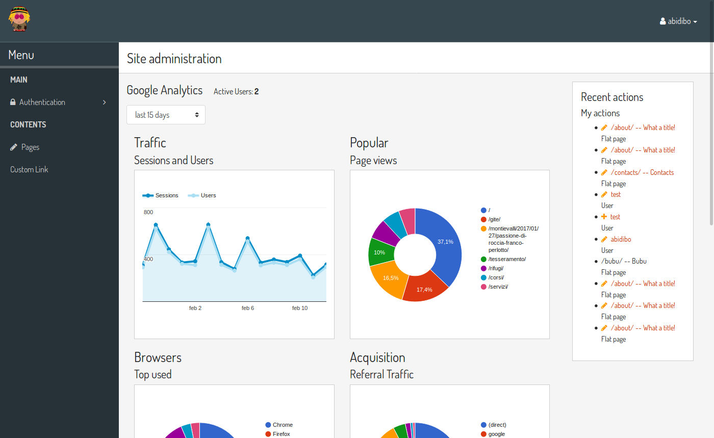
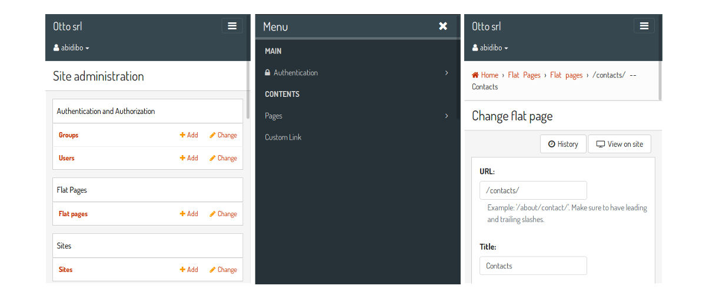
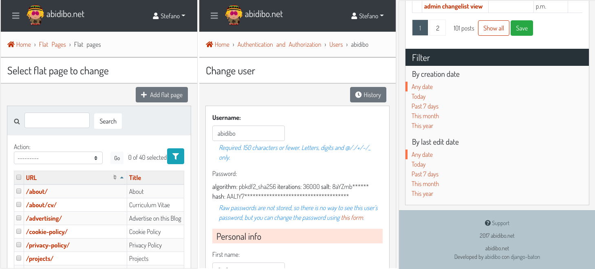
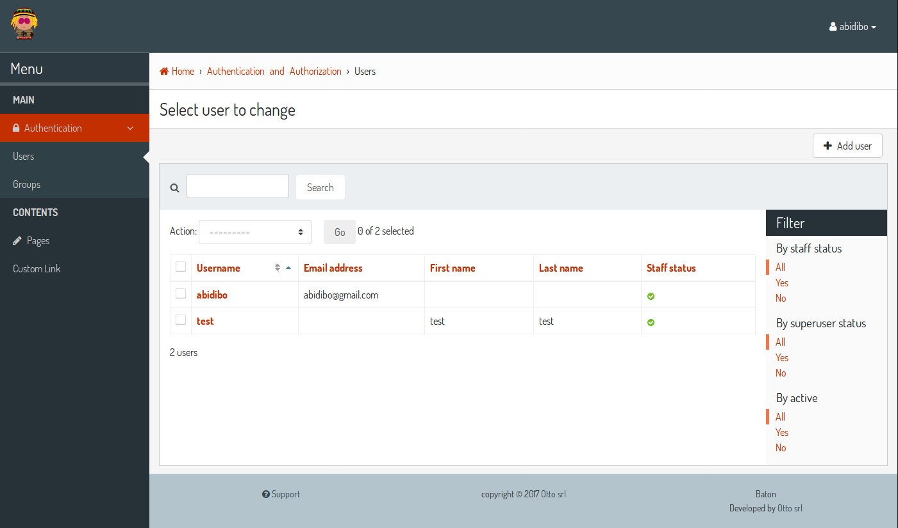
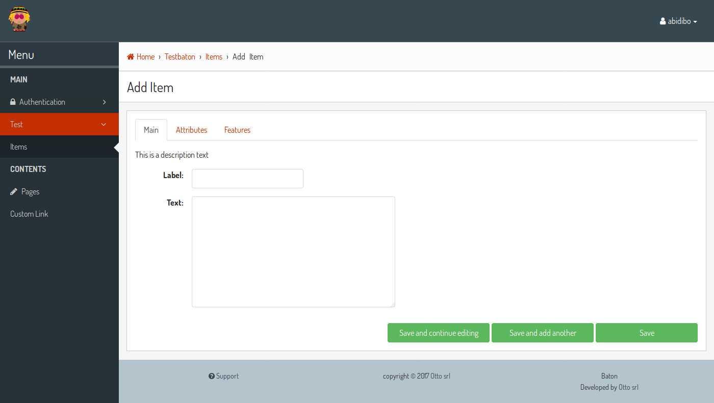
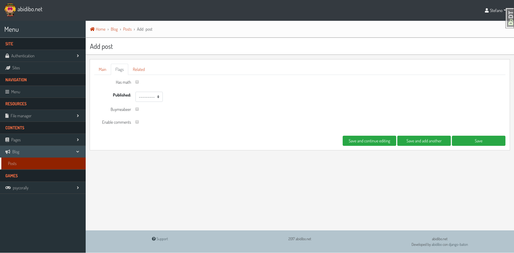
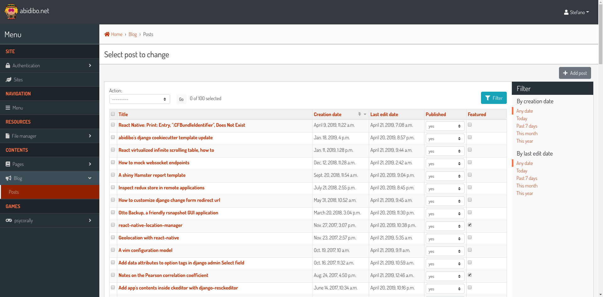
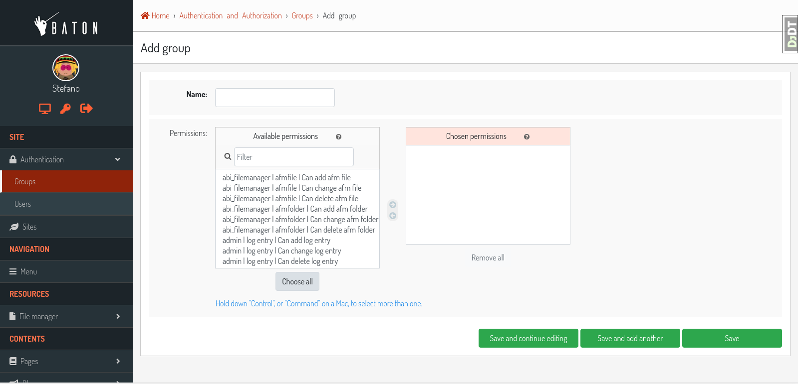
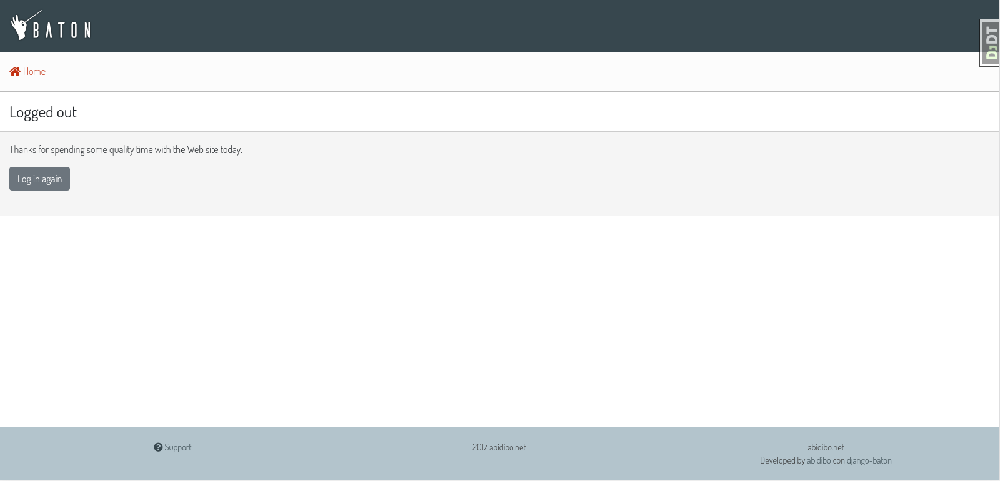
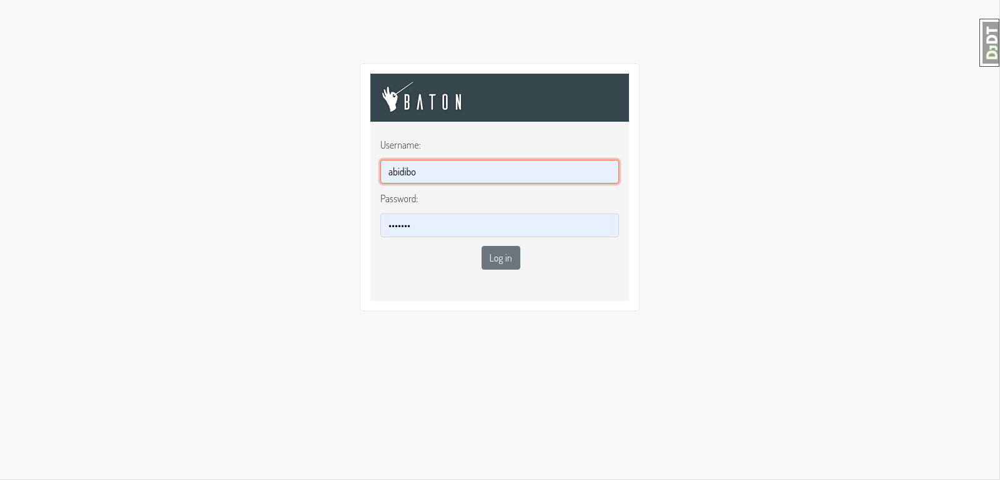

# django-baton

[](https://pepy.tech/project/django-baton)

A cool, modern and responsive django admin application, based on bootstrap 4.3.1

Documentation: [readthedocs](http://django-baton.readthedocs.io/)



## Table of contents

- [Features](#features)
- [Installation](#installation)
- [Configuration](#configuration)
    - [Menu](#configuration-menu)
    - [Analytics](#configuration-analytics)
- [Signals](#signals)
- [Text Input Filters](#text-input-filters)
- [Form Tabs](#form-tabs)
- [Customization](#customization)
- [Contributing](#contributing)
- [Screenshots](#screenshots)

## <a name="features"></a>Features

Tested with django 1.10.5, 1.11.1, 2.0, 2.1 and 2.2

This application was written with one concept in mind: overwrite as few django templates as possible.
Everything is styled through css, and when an help is needed, js is armed.

- Based on bootstrap 4.3.1 and FontAwesome Free 5.8.1
- Fully responsive
- Custom and flexible sidebar menu
- Text input filters facility
- Form tabs out of the box
- Lazy load of current uploaded images
- Optional index page filled with google analytics widgets
- Customization available recompiling the js app provided
- it translations provided

It requires the following python packages in order to manage the google analytics index:

- google-api-python-client
- oauth2client==1.5.2

At the moment __baton__ defines only 3 custom templates:

- `admin/base_site.html`, needed in order to inject the js application (which includes also css and graphics, compiled with [webpack](https://webpack.github.io/));
- `admin/delete_confirmation.html`, needed because of a bug (IMO) in the template, in particular the `extra_head` block does not contain the parent content, hence it must be overridden (FIXED IN django 1.11, remains until baton will support django 1.10);
- `admin/delete_selected_confirmation.html`, same as above.

Baton is based on the following frontend technologies:

- bootstrap 4.3.1
- FontAwesome 5.8.1 (solid and brands)

Flexbox is used here and there to accomplish responsiveness. jQuery is used for DOM manipulations.

All js, fonts and css are compiled, and produce a single js file which is included in the base_site template.

A custom menu is provided, the menu is rendered through js, and data are fetched in json format through ajax request.

## <a name="installation"></a>Installation

Install the last stable release

    pip install django-baton

or clone the repo inside your project

    git clone https://github.com/otto-torino/django-baton.git

Add `baton` and `baton.autodiscover` to your `INSTALLED_APPS`:

    INSTALLED_APPS = (
        # ...
        'baton',
        'django.contrib.admin',
        # ...
        'baton.autodiscover',
    )

Replace django.contrib.admin in your project urls, and add baton urls:

    # from django.contrib import admin
    from baton.autodiscover import admin

    urlpatterns = [
        url(r'^admin/', include(admin.site.urls)),
        # ...
        url(r'^baton/', include('baton.urls')),
    ]

### Django 2

The first two steps are the same, but in your project urls you should now use path:

    from baton.autodiscover import admin
    from django.urls import path, include

    urlpatterns = [
        path('admin/', admin.site.urls),
        path('baton/', include('baton.urls')),

    ]

If you get a "__No crypto library available__" when using the google analytics index, then install this package:

    $ pip install PyOpenSSL

### Why two installed apps?

Well, the first `baton` has to be placed before the `django.contrib.admin` app, because it overrides 3 templates and resets all css.
The `baton.autodiscover` entry is needed as the last installed app in order to register all applications for the admin.
I decided to create a custom `AdminSite` class, in order to allow the customization of some variables the django way (`site_header`, `index_title`, ...). I think this is a good approach,
better than customizing this vars overwriting the orignal templates. The problem is that when creating a custom AdminSite, you should register manually all the apps. I didn't like
this, so I wrote this `autodiscover` module, which automatically registers all the apps already registered with the django default AdminSite. In order to do this, all the apps must be already registered, so it comes as the last installed app.

## <a name="configuration"></a>Configuration

The configuration dictionary must be defined inside your settings:

    BATON = {
        'SITE_HEADER': 'Baton',
        'SITE_TITLE': 'Baton',
        'INDEX_TITLE': 'Site administration',
        'SUPPORT_HREF': 'https://github.com/otto-torino/django-baton/issues',
        'COPYRIGHT': 'copyright © 2017 <a href="https://www.otto.to.it">Otto srl</a>', # noqa
        'POWERED_BY': '<a href="https://www.otto.to.it">Otto srl</a>',
        'CONFIRM_UNSAVED_CHANGES': True,
        'SHOW_MULTIPART_UPLOADING': True,
        'ENABLE_IMAGES_PREVIEW': True,
        'MENU': (
            { 'type': 'title', 'label': 'main', 'apps': ('auth', ) },
            {
                'type': 'app',
                'name': 'auth',
                'label': 'Authentication',
                'icon': 'fa fa-lock',
                'models': (
                    {
                        'name': 'user',
                        'label': 'Users'
                    },
                    {
                        'name': 'group',
                        'label': 'Groups'
                    },
                )
            },
            { 'type': 'title', 'label': 'Contents', 'apps': ('flatpages', ) },
            { 'type': 'model', 'label': 'Pages', 'name': 'flatpage', 'app': 'flatpages' },
            { 'type': 'free', 'label': 'Custom Link', 'url': 'http://www.google.it', 'perms': ('flatpages.add_flatpage', 'auth.change_user') },
            { 'type': 'free', 'label': 'My parent voice', 'children': [
                { 'type': 'model', 'label': 'A Model', 'name': 'mymodelname', 'app': 'myapp' },
                { 'type': 'free', 'label': 'Another custom link', 'url': 'http://www.google.it' },
            ] },
        ),
        'ANALYTICS': {
            'CREDENTIALS': os.path.join(BASE_DIR, 'credentials.json'),
            'VIEW_ID': '12345678',
        }
    }

- `SITE_HEADER`, `COPYRIGHT` and `POWERED_BY` are marked as safe, so you can include also img tags and links, for example.
- `SUPPORT_HREF` is the content of an href attribute, then you can use also a `mailto:info@blabla.com`
- `CONFIRM_UNSAVED_CHANGES`: if set to `True` a confirmation modal appears when leaving a change form or add form with unsaved changes.
The check of a dirty form relies on the jQuery serialize method, so it's not 100% safe. Disabled inputs, particular widgets (ckeditor) can not be detected.
Default value is `True`.
- `SHOW_MULTIPART_UPLOADING`: if set to `True` an overlay with a spinner appears when submitting a `multipart/form-data` form.
- `ENABLE_IMAGES_PREVIEW`: if set to `True` a preview is displayed above all input file fields which contain images. You can control how the preview is displayed overriding the class `.baton-image-preview`. By default previews are 100px height and with a box shadow on over event.

Let's see the `MENU` and `ANALYTICS` configurations in detail.

### <a name="configuration-menu"></a>MENU

Currently four kind of voices are supported: _title_, _app_, _model_ and _free_.

Title and free voices can have children, children follow the following rules:

- children voices children are ignored (do not place an app voice as child)

First of all, if you don't define a MENU key in the configuration dictionary, the default MENU is shown.
If you define a MENU key, then the custom menu is built and shown.

#### Title

Like __MAIN__ and __CONTENTS__ in the screenshot, it represents a menu section. You should set a label and optionally an apps or perms key, used for visualization purposes.

If the title voice should act as a section title for a group of apps, you'd want to specify these apps, because if the user can't operate over them, then the voice is not shown.
At the same time you can define some perms (OR condition), something like:

    { 'type': 'title', 'label': 'main', 'perms': ('auth.add_user', ) },

#### App

You must specify the _type_ and _name_ keys, optionally an icon key (you can use FontAwesome classes which are included by default) and a _models_ key.
If you don't define the _models_ key then the default app models are listed under your app, otherwise only the specified models are listed (in the order you provide).

#### Model

You must specify the _type_, _name_ and _app_ keys, optionally an icon key (you can use FontAwesome classes which are included by default).

#### Free

You can specify free voices, you must define an _url_ and if you want some visibility permissions (OR clause)

### <a name="configuration-analytics"></a>ANALYTICS

You can create a cool index page displaying some statistics widgets consuming the google analytics api, just by defining the `ANALYTICS` setting.

It requires two keys:

- `CREDENTIALS`: it is the path to the credentials json file
- `VIEW_ID`: id of the view from which display data

You can add contents before and after the analytics dashboard by extending the `baton/analytics.html` template and filling the `baton_before_analytics` and `baton_after_analytics` blocks.

#### How to generate a credentials json file

Follow the steps in the Google Identity Platform documentation to [create a service account](https://developers.google.com/identity/protocols/OAuth2ServiceAccount#creatinganaccount) from the [Google Developer Console](https://console.developers.google.com/).

Once the service account is created, you can click the Generate New JSON Key button to create and download the key and add it to your project.

Add the service account as a user in Google Analytics. The service account you created in the previous step has an email address that you can add to any of the Google Analytics views you'd like to request data from. It's generally best to only grant the service account read-only access.

## <a name="signals"></a>Signals

Baton provides a dispatcher that can be used to register function that will be called when some events occurr.
At this moment Baton emits four types of events:

- `onNavbarReady`: dispatched when the navbar is fully rendered
- `onMenuReady`: dispatched when the menu is fully rendered (probably the last event fired, since the menu contents are retrieves async)
- `onTabsReady`: dispatched when the changeform tabs are fully rendered
- `onMenuError`: dispatched if the request sent to retrieve menu contents fails
- `onReady`: dispatched when Baton js has finished its sync job

In order to use them just override the baton `admin/base_site.html` template and register your listeners **before** calling `Baton.init`, i.e.

    <!-- ... -->
    <script>
        
        
        (function ($, undefined) {
            $(window).on('load', function () {
                // init listeners
                Baton.Dispatcher.register('onReady', function () { console.log('BATON IS READY') })
                Baton.Dispatcher.register('onMenuReady', function () { console.log('BATON MENU IS READY') })
                Baton.Dispatcher.register('onNavbarReady', function () { console.log('BATON NAVBAR IS READY') })
                // end listeners
                Baton.init({
                    api: {
                        app_list: ''
                    },
                    confirmUnsavedChanges: truefalse,
                    showMultipartUploading: truefalse
                });
            })
        })(jQuery, undefined)
    </script>
    <!-- ... -->

## <a name="text-input-filters"></a>Text Input Filters

Taken from this [medium article](https://medium.com/@hakibenita/how-to-add-a-text-filter-to-django-admin-5d1db93772d8)

Baton defines a custom InputFilter class that you can use to create text input filters and use them as any other `list_filters`, for example

``` python

# your app admin

from baton.admin import InputFilter

class IdFilter(InputFilter):
    parameter_name = 'id'
    title = 'id'
 
    def queryset(self, request, queryset):
        if self.value() is not None:
            search_term = self.value()
            return queryset.filter(
                id=search_term
            )


class MyModelAdmin(admin.ModelAdmin):
    list_filters = (
        'my_field',
        IdFilter,
        'my_other_field',
    )

```

## <a name="form-tabs"></a>Form tabs

How much I loved django-suit form tabs? Too much. So, this was a feature I couldn't live without.

There are three types of tabs:

- **fieldset tab**: a tab containing a fieldset
- **inline tab**: a tab containing an inline
- **group tab**: a tab which can contain fieldsets and inlines in the order you specify

Tabs' titles are retrieved automatically, for fieldset and inline tabs are the fieldset title and the inline related verbose name plural.
For group tabs the first title is taken (either of an inline or fieldset section).

Using group tabs you can mix inlines with fields, just by splitting fields into fieldsets and arranging them in your preferred order.

Let's see how to define tabs in your admin forms (everyting is done through js, no templatetags, no templates overriden):

    class AttributeInline(admin.StackedInline):
        model = Attribute
        extra = 1

    class FeatureInline(admin.StackedInline):
        model = Feature
        extra = 1

    class ItemAdmin(admin.ModelAdmin):
        list_display = ('label', 'description', 'main_feature', )
        inlines = [AttributeInline, FeatureInline, ]

        fieldsets = (
            ('Main', {
                'fields': ('label', ),
                'classes': ('baton-tabs-init', 'baton-tab-inline-attribute', 'baton-tab-fs-content', 'baton-tab-group-fs-tech--inline-feature', ),
                'description': 'This is a description text'

            }),
            ('Content', {
                'fields': ('text', ),
                'classes': ('tab-fs-content', ),
                'description': 'This is another description text'

            }),
            ('Tech', {
                'fields': ('main_feature', ),
                'classes': ('tab-fs-tech', ),
                'description': 'This is another description text'

            }),
        )

As you can see these are the rules:

- Inline classes remain the same, no action needed
- In the first fieldset define a `baton-tabs-init` class which enables tabs
- For every InLine you want to put in a separate tab, add a class `baton-tab-inline-MODELNAME` or `baton-tab-inline-RELATEDNAME` if you've specified a related name in the model foreign key field
- For every fieldset you want to put in a separate tab, add a class `baton-tab-fs-CUSTOMNAME`, and add a class `tab-fs-CUSTOMNAME` on the fieldset
- For every group you want to put in a separate tab, add a class `baton-tab-group-ITEMS`, where items can be inlines (`inline-RELATEDNAME`) and/or fieldsets (`fs-CUSTOMNAME`) separated by a double hypen `--`. Also add a class `tab-fs-CUSTOMNAME` on the fieldset items.
- Tabs order respects the defined classes order

Other features:

- when some field has an error, the first tab containing errors is opened automatically
- you can open a tab on page load just by adding an hash to the url, i.e. `#inline-feature`, `#fs-content`, `#group-fs-tech--inline-feature`

## <a name="customization"></a>Customization

It's easy to heavily customize the appeareance of __baton__. All the stuff is compiled from a modern js app which resides in `baton/static/baton/app`.

You just need to change the [sass variables values](https://github.com/otto-torino/django-baton/blob/master/baton/static/baton/app/src/styles/_variables.scss) (and you can overwrite also bootstrap variables), re-compile, get the compiled js file, place it in the static folder of your main app,
and place your main app (ROOTAPP) before __baton__ in the `INSTALLED_APPS`.

So:

    $ git clone https://github.com/otto-torino/django-baton.git
    $ cd django-baton/baton/static/baton/app/
    $ npm install
    $ vim src/styles/_variables.scss
    $ npm run compile
    $ cp dist/baton.min.js ROOTAPP/static/baton/app/dist/

If you want to test live your changes it's easy, just start the webpack dev server:

    $ cd django-baton/baton/static/baton/app/
    $ npm run dev

And the inside the `base_site.html` template make these changes:

    <!-- <script src=""></script> comment the compiled src and uncomment the webpack served src -->
    <script src="http://localhost:8080/dist/baton.min.js"></script>

Now while you make your changes to the js app (css included), webpack will update the bundle automatically, so just refresh the page and you'll see your changes.

## <a name="contributing"></a>Contributing

I'll soon add more stuff here, but at the moment what is really important, is to follow the eslint rules specified in the `.eslintrc` file (https://github.com/otto-torino/django-baton/blob/master/baton/static/baton/app/.eslintrc) for the js part, and be compliant with the standard sasslint rules for the sass part. I follow PEP8 standard for the few lines of python code.

## <a name="screenshots"></a>Screenshots



















