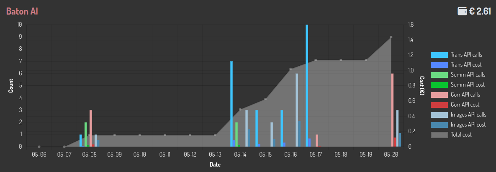

AI
==

Starting from 4.0.0, the new AI functionalities are available:

- Automatic translations with django-modeltranslation
- Text corrections
- Text summarization
- Image generation

You can choose which AI model to use for each functionality, see the Configuration section.

Automatic Translations
----------------------

In the configuration section you can specify if you want to enable the automatic translation with django-modeltranslation. If you enable it, the functionality will be activated sitewide.
In every add/change form page which contains fields that need to be translated, the ``Translate`` button will appear in the ``object tools`` position.

Clicking it all the empty fields that need a translations will be filled with the translation fetched.

All default fields and CKEditor fields are supported out of the box. Other rich-text editors (e.g. Editor.js via ``dj-editor-js``) plug in through editor adapters, see the Editor Adapters section below.

Corrections
-----------

In the configuration section you can specify if you want to enable the corrections feature. If you enable it, the functionality will be activated sitewide.
In every add/change form page which contains text fields (also CKEditor and Editor.js), an icon will appear near the label to trigger the AI correction.
See the Editor Adapters section below if you need to support other wysiwyg editors.

When triggering the correction there are two possible results:

- the corrected text is the same as the original one: nothing happens, only a green check icon appears near the field
- the corrected text is different from the original one: a modal is shown with the diff between the original and the corrected text, and the user can decide to use the corrected text.

The default selectors are `textarea` and `input[type=text]:not(.vDateField):not([name=username]):not([name*=subject_location])`, you can change them in the configuration:::

    ...
    'AI': {
        'ENABLE_CORRECTIONS': True,
        'CORRECTION_SELECTORS': ["textarea", "input[type=text]:not(.vDateField):not([name=username]):not([name*=subject_location])"],
    },
    ...

There is another way to trigger the correction in cases the label is not visible: ctrl + left mouse click on the field.

Text Summarization
------------------

In your ``ModelAdmin`` classes you can define which fields can be summarized to create a content used to fill other model fields, look at the following example:::

    class MyModelAdmin(admin.ModelAdmin):
        # ...
        baton_summarize_fields = {
            "text_it": [{
                "target": "abstract_it",
                "words": 140,
                "useBulletedList": True,
                "language": "it",
            }, {
                "target": "meta_description_it",
                "words": 45,
                "useBulletedList": False,
            }],
        }

You have to specify the target field name. You can also optionally specify the follwing parameters:

- ``words``: number of words used in the summary (approximate, it will not be followed strictly)
- ``useBulletedList``: if the summary should be in a bulleted list
- ``language``: the language of the summary, default is your default language

The ``words`` and ``useBulletedList`` parameters can be edited int the UI when actually summarizing the text.

With this configuration, two (the number of targets) buttons will appear near the ``text_it`` field, each one opening a modal dialog with the configuration for the target field.
In this modal you can edit the ``words`` and ``useBulletedList`` parameters and perform the summarization that will be inserted in the target field.

All default fields and CKEditor fields are supported out of the box. Other rich-text editors (e.g. Editor.js via ``dj-editor-js``) plug in through editor adapters, see the Editor Adapters section below.

Image Generation
----------------

Baton provides a new model field and a new image widget which can be used to generate images from text. The image field can be used as a normal image field, but also a new button will appear near it. 
The button will open a modal where you can set some options, describe the image you want and generate the image. You can then preview the image and if you like it you can save it in the 
file field with just one click.::

    from baton.fields import BatonAiImageField

    class MyModel(models.Model):
        image = BatonAiImageField(verbose_name=_("immagine"), upload_to="news/")

There is also another way to add the AI image generation functionality to a normal ImageField if you do not want to use the BatonAiImageField model field:::

    

Baton also integrates the functionality of `django-subject-imagefield <https://github.com/otto-torino/django-subject-imagefield>`_, so you can specify a `subject_location` field that will store the percentage coordinated of the subject of the image, and in editing mode a point will appear on the image preview in order to let you change this position::

    from baton.fields import BatonAiImageField

    class MyModel(models.Model):
        image = BatonAiImageField(verbose_name=_("immagine"), upload_to="news/", subject_location_field='subject_location')
        subject_location = models.CharField(max_length=7, default="50,50")

You can configure the width of the preview image through the settings ``IMAGE_PREVIEW_WIDTH`` which by default equals ``200``.

Check the ``django-subject-imagefield`` documentation for more details and properties.

Image Vision
------------

There are two ways to activate image vision functionality in Baton, both allow to generate an alt text for the image through the AI.

The first way is to just use the ``BatonAiImageField`` and define the ``alt_field`` attribute (an optionally ``alt_chars``, ``alt_language``)::

    from baton.fields import BatonAiImageField

    class MyModel(models.Model):
        image = BatonAiImageField(verbose_name=_("immagine"), upload_to="news/", alt_field="image_alt", alt_chars=20, alt_language="en")
        image_alt = models.CharField(max_length=40, blank=True)

This method will work only when images are inside inlines.

The second method consists in defining in the ``ModelAdmin`` classes which images can be described in order to generate an alt text, look at the following example::

    class MyModelAdmin(admin.ModelAdmin):
        # ...
        baton_vision_fields = {
            "#id_image": [{ # key must be a selector (useful for inlines)
                "target": "image_alt", # target should be the name of a field of the same model
                "chars": 80,
                "language": "en",
            }],
        }

You have to specify the target field name. You can also optionally specify the follwing parameters:

- ``chars``: max number of characters used in the alt description (approximate, it will not be followed strictly, default is 100)
- ``language``: the language of the summary, default is your default language

With this configuration, one (the number of targets) button will appear near the ``image`` field, clicking it the calculated image alt text will be inserted in the ``image_alt`` field.

Stats
----------------

Baton provides a new widget which can be used to display stats about AI usage. Just include it in your admin index template:::

    
    

Editor Adapters
----------------

Baton AI functionalities do their job inspecting fields, retrieving and setting their values. Native HTML inputs/textareas and fields managed by ``django-ckeditor`` are supported out of the box. Other rich-text editors plug in through **editor adapters**, and multiple editors can coexist on the same form (e.g. CKEditor *and* another editor).

.. note::
    Already using ``dj-editor-js`` (Editor.js for Django)? Nothing to configure, it ships its own adapter that self-registers. See the *Baton AI + Editor.js* section below.

An adapter is a plain object implementing the following contract:::

    const MyEditorAdapter = {
      name: 'my-editor',
      // Return the ids of the fields this editor manages
      getFields() { return Object.keys(window.MyEditor.instances) },
      // Return the field content (string), or undefined if not owned by this editor
      getValue(fieldId) { return window.MyEditor.instances[fieldId]?.getContent() },
      // Set the content; return true if handled, false if not owned
      setValue(fieldId, value) {
        const inst = window.MyEditor.instances[fieldId]
        if (!inst) return false
        inst.setContent(value)
        return true
      },
      // Render the "correct" checkmark icon near the field; return true if handled
      setCorrect(fieldId, icon) {
        const inst = window.MyEditor.instances[fieldId]
        if (!inst) return false
        Baton.jQuery(`#${fieldId}`).after(icon)
        return true
      },
    }

Register it in your ``admin/base_site.html``, **after** ``baton.min.js`` and **before** ``init_baton.js``:::

    
    
    

Registered adapters are consulted before the built-in CKEditor adapter, which is consulted last as a fallback.

AI Hooks (legacy)
-----------------

.. note::
    The single-override ``*Hook`` functions below are still supported for backward compatibility, but the editor adapter API above is recommended for new code. When defined, the legacy hooks are wrapped as a highest-priority adapter that falls through to any registered adapters and to CKEditor, so they coexist with the adapter API.

Place these hook definitions in your ``admin/base_site.html`` template, before the ```` script tag:::

    <!-- admin/base_site.html -->
    
    
    

Baton AI + Editor.js
--------------------

`Editor.js for Django <https://github.com/otto-torino/django-editor-js>`_ (the ``dj-editor-js`` package on PyPI, version 0.2.0+) integrates with Baton AI **out of the box, zero-config**. It ships an editor adapter that self-registers on ``Baton.AI``, so translation, summarization and correction work on Editor.js fields, coexisting with CKEditor and native fields on the same form.

There is nothing to add to ``admin/base_site.html``: the adapter is loaded automatically via the widget's ``Media``. Just make sure both apps are installed and the AI credentials are configured:::

    INSTALLED_APPS = [
        "baton",
        "editor_js",
        # ...
        "baton.autodiscover",
    ]

    BATON = {
        "BATON_CLIENT_ID": os.getenv("BATON_CLIENT_ID"),
        "BATON_CLIENT_SECRET": os.getenv("BATON_CLIENT_SECRET"),
        "AI": {
            "ENABLE_TRANSLATIONS": True,
            "ENABLE_CORRECTIONS": True,
        },
    }

Then use an ``EditorJSField`` on your model (translatable via ``django-modeltranslation``, or as a summarization target) and the AI buttons appear as for any other field. Under the hood the adapter converts Editor.js' block JSON to/from HTML so the AI sees clean prose; non-text blocks (images, tables, embeds, ...) are not sent to the AI.
