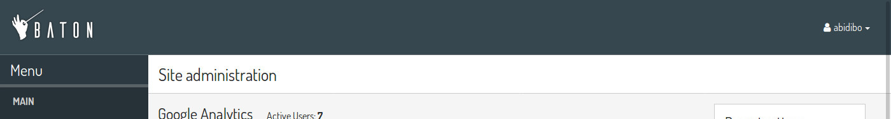
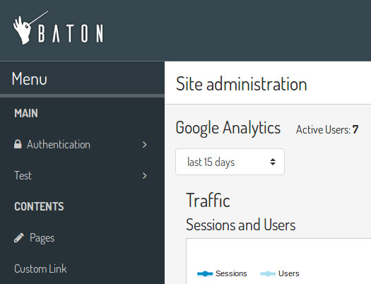
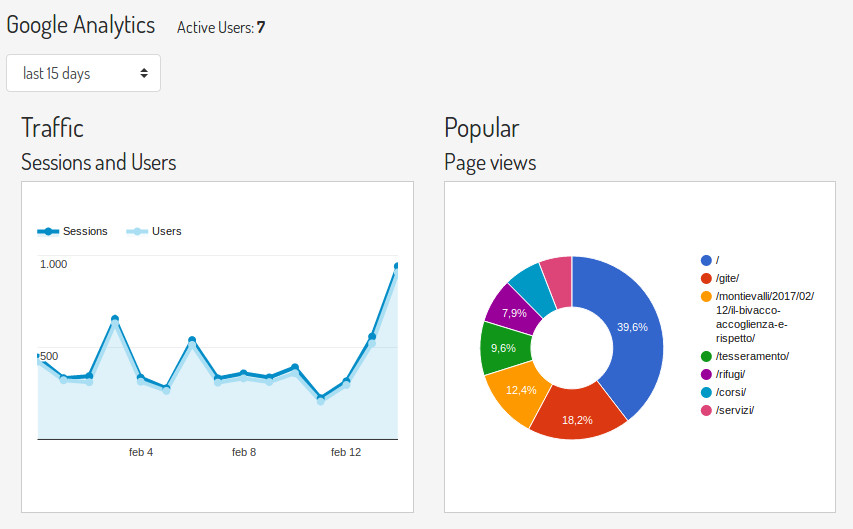

Configuration
=============

You can configure your baton installation defining a config dictionary in your ``settings.py``

Example
-------

This is an example of configuration::

    BATON = {
        'SITE_HEADER': 'Baton',
        'SITE_TITLE': 'Baton',
        'INDEX_TITLE': 'Site administration',
        'SUPPORT_HREF': 'https://github.com/otto-torino/django-baton/issues',
        'COPYRIGHT': 'copyright © 2017 <a href="https://www.otto.to.it">Otto srl</a>', # noqa
        'POWERED_BY': '<a href="https://www.otto.to.it">Otto srl</a>',
        'CONFIRM_UNSAVED_CHANGES': True,
        'SHOW_MULTIPART_UPLOADING': True,
        'ENABLE_IMAGES_PREVIEW': True,
        'MENU': (
            { 'type': 'title', 'label': 'main', 'apps': ('auth', ) },
            {
                'type': 'app',
                'name': 'auth',
                'label': 'Authentication',
                'icon': 'fa fa-lock',
                'models': (
                    {
                        'name': 'user',
                        'label': 'Users'
                    },
                    {
                        'name': 'group',
                        'label': 'Groups'
                    },
                )
            },
            { 'type': 'title', 'label': 'Contents', 'apps': ('flatpages', ) },
            { 'type': 'model', 'label': 'Pages', 'name': 'flatpage', 'app': 'flatpages' },
            { 'type': 'free', 'label': 'Custom Link', 'url': 'http://www.google.it', 'perms': ('flatpages.add_flatpage', 'auth.change_user') },
            { 'type': 'free', 'label': 'My parent voice', 'children': [
                { 'type': 'model', 'label': 'A Model', 'name': 'mymodelname', 'app': 'myapp', 'icon': 'fa fa-gavel' },
                { 'type': 'free', 'label': 'Another custom link', 'url': 'http://www.google.it' },
            ] },
        ),
        'ANALYTICS': {
            'CREDENTIALS': os.path.join(BASE_DIR, 'credentials.json'),
            'VIEW_ID': '12345678',
        }
    }

Site header
-----------

**Default**: baton logo

.. important:: ``SITE_HEADER`` is marked as safe, so you can include img tags or links

Site title
-----------

**Default**: 'Baton'

Index title
-----------

**Default**: 'Site administration'

Support href
------------

This is the content of the href attribute of the support link rendered in the footer.

**Default**: 'https://github.com/otto-torino/django-baton/issues'

**Example**: 'mailto:support@company.org'

Copyright
---------

A copyright string inserted centered in the footer

**Default**: 'copyright © 2017 <a href="https://www.otto.to.it">Otto srl</a>'

.. important:: ``COPYRIGHT`` is marked as safe, so you can include img tags or links

Powered by
----------

A powered by information included in the right part of the footer, under the ``SITE_TITLE`` string

**Default**: '<a href="https://www.otto.to.it">Otto srl</a>'

.. important:: ``POWERED_BY`` is marked as safe, so you can include img tags or links

Confirm unsaved changes
-----------------------

Alert the user when he's leaving a change or add form page without saving changes

**Default**: True

.. important:: The check for a dirty form relies on the jQuery serialize method, so it's not 100% safe. Disabled inputs, particular widgets (ckeditor) can not be detected.

Show multipart uploading
-----------------------

Show an overlay with a spinner when a ``multipart/form-data`` form is submitted

**Default**: True

Enable images preview
-----------------------

Displays a preview above all input file fields which contain images. You can control how the preview is displayed overriding the class ``.baton-image-preview``. By default previews are 100px height and with a box shadow on over event

**Default**: True

Menu
----

The sidebar menu is rendered through javascript.

If you don't define a custom menu, the default menu is rendered, which includes all the apps and models registered in the admin that the user can view.

When defining a custom menu you can use 4 different kinds of voices:

- title
- app
- model
- free

Title and free voices can have children. Children follow these rules:

- children children are ignored (do not place an app voice as child)

Title
^^^^^

Like the voices `MAIN` and `CONTENTS` in the above image, it represents a menu section. You should set a ``label`` and optionally an ``apps`` or ``perms`` key, used for visualization purposes.

If the title voice should act as a section title for a group of apps, you'd want to specify these apps, because if the user can't operate over them, then the voice is not shown. At the same time you can define some perms (OR condition), something like: ::

    { 'type': 'title', 'label': 'main', 'perms': ('auth.add_user', ) },

or ::

    { 'type': 'title', 'label': 'main', 'apps': ('auth', ) },

It accepts children voices.

App
^^^

In order to add an application with all its models to the menu, you need an `app` menu voice.

You must specify the ``type`` and ``name`` keys, optionally an ``icon`` key (you can use FontAwesome classes which are included by default) and a ``models`` key.

.. important:: If you don't define the models key then the default app models are listed under your app, otherwise only the specified models are listed (in the order you provide).

The ``models`` key must be a tuple, where every item represents a model in the form of a dictionary with keys ``label`` and ``name`` ::

    {
        'type': 'app',
        'name': 'auth',
        'label': 'Authentication',
        'icon': 'fa fa-lock',
        'models': (
            {
                'name': 'user',
                'label': 'Users'
            },
            {
                'name': 'group',
                'label': 'Groups'
            },
        )
    },

Model
^^^^^

If you want to add only a link to the admin page of a single model, you can use this voice. For example, the `flatpages` app has only one model `Flatpage`, so I think it may be better to avoid a double selection.

In this case you must specify the ``type``, ``name`` and ``app`` keys, optionally an ``icon`` key (you can use FontAwesome classes which are included by default). An example: ::

    { 'type': 'model', 'label': 'Pages', 'name': 'flatpage', 'app': 'flatpages', 'icon': 'fa fa-file-text-o' },

Free
^^^^

If you want to link an external site, a documentation page, an add element page and in general every custom resource, you may use this voice.

In such case you must define an ``url`` and if you want some visibility permissions (OR clause) ::

    { 'type': 'free', 'label': 'Docs', 'url': 'http://www.mydocssite.com' },

or :: 
    
    { 'type': 'free', 'label': 'Add page', 'url': '/admin/flatpages/flatpage/add/', 'perms': ('flatpages.add_flatpage', ) },

It accepts children voices ::

    { 'type': 'free', 'label': 'My parent voice', 'children': [
        { 'type': 'free', 'label': 'Docs', 'url': 'http://www.mydocssite.com' },
        { 'type': 'free', 'label': 'Photos', 'url': 'http://www.myphotossite.com' },
    ] },

Analytics
---------

Baton provides an index view which displays google analytics statistics charts for the last 15 days, 1 month, 3 month and 1 year.

In order to activate it you need to create a service account and link it to your google analytics view, then you must define the keys:

- ``CREDENTIALS``: path to the credentials json file
- ``VIEW_ID``: id of the analytics view which serves the data

You can add contents before and after the analytics dashboard by extending the ``baton/analytics.html`` template and filling the ``baton_before_analytics`` and ``baton_after_analytics`` blocks.

How to generate a credentials json file
^^^^^^^^^^^^^^^^^^^^^^^^^^^^^^^^^^^^^^^

Follow the steps in the Google Identity Platform documentation to `create a service account <https://developers.google.com/identity/protocols/OAuth2ServiceAccount#creatinganaccount>`_ from the `Google Developer Console <https://console.developers.google.com/>`_.

Once the service account is created, you can click the Generate New JSON Key button to create and download the key and add it to your project.

Add the service account as a user in Google Analytics. The service account you created in the previous step has an email address that you can add to any of the Google Analytics views you'd like to request data from. It's generally best to only grant the service account read-only access.
