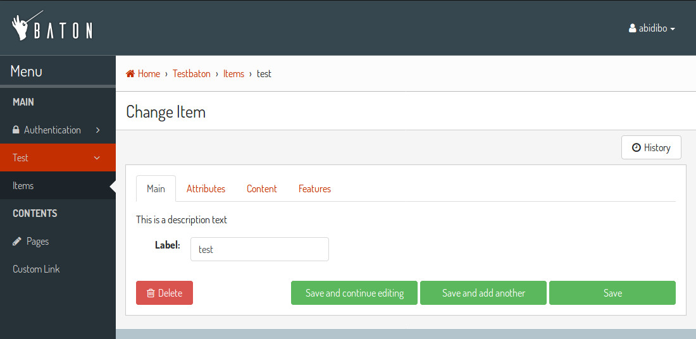

Form tabs
=========

Baton provides an easy way to define form tabs in yor change form templates. Everything is done through javascript and you only need to add some classes you your ``ModelAdmin`` fieldsets ::

    from django.contrib import admin
    from .models import Item, Attribute, Feature

    class AttributeInline(admin.StackedInline):
        model = Attribute
        extra = 1

    class FeatureInline(admin.StackedInline):
        model = Feature
        extra = 1

    class ItemAdmin(admin.ModelAdmin):
        list_display = ('label', 'description', 'main_feature', )
        inlines = [AttributeInline, FeatureInline, ]

        fieldsets = (
            ('Main', {
                'fields': ('label', ),
                'classes': ('baton-tabs-init', 'baton-tab-inline-attribute', 'baton-tab-fs-content', 'baton-tab-group-fs-tech--inline-feature', ),
                'description': 'This is a description text'

            }),
            ('Content', {
                'fields': ('text', ),
                'classes': ('tab-fs-content', ),
                'description': 'This is another description text'

            }),
            ('Tech', {
                'fields': ('main_feature', ),
                'classes': ('tab-fs-tech', ),
                'description': 'This is another description text'

            }),
        )

Rules
-----

- Inline classes remain the same, no action needed
- In the first fieldset define a ``baton-tabs-init`` class which enables tabs
- For every ``InLine`` you want to put in a separate tab, add a class ``baton-tab-inline-MODELNAME`` or ``baton-tab-inline-RELATEDNAME`` if you've specified a related_name to the foreign key
- For every fieldset you want to put in a separate tab, add a class ``baton-tab-fs-CUSTOMNAME``, and add a class ``tab-fs-CUSTOMNAME`` on the fieldset
- For every group you want to put in a separate tab, add a class ``baton-tab-group-ITEMS``, where items can be inlines (``inline-RELATEDNAME``) and/or fieldsets (``fs-CUSTOMNAME``) separated by a double hypen ``--``. Also add a class ``tab-fs-CUSTOMNAME`` on the fieldset items.
- Tabs order respects the defined classes order

Other features:

- when some field has an error, the first tab containing errors is opened automatically
- you can open a tab on page load just by adding an hash to the url, i.e. #inline-feature, #fs-content, #group-fs-tech--inline-feature
