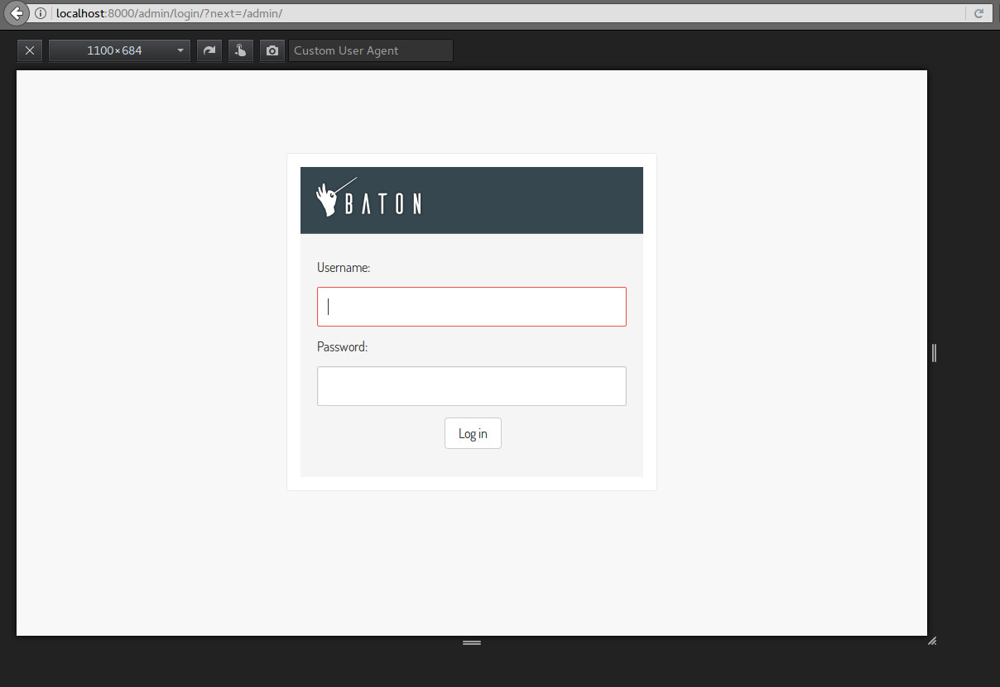
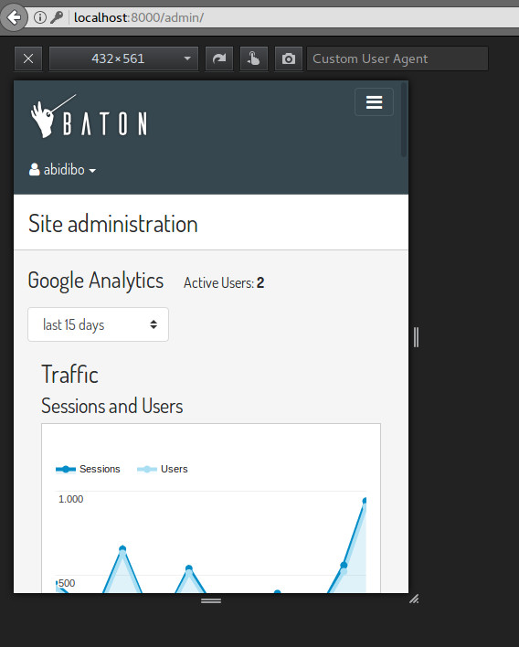
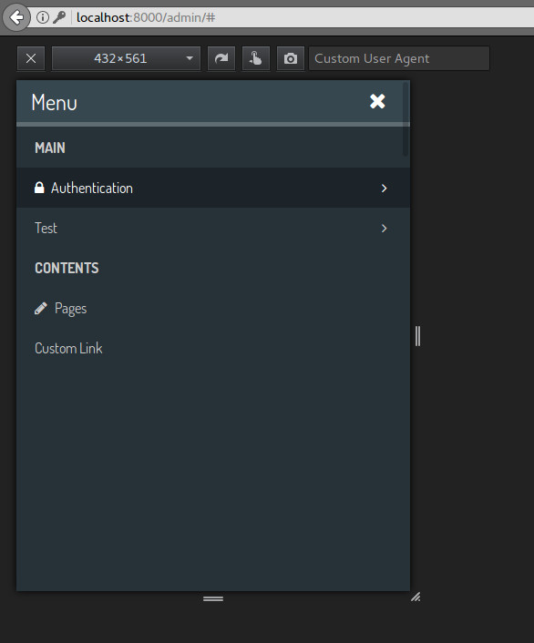
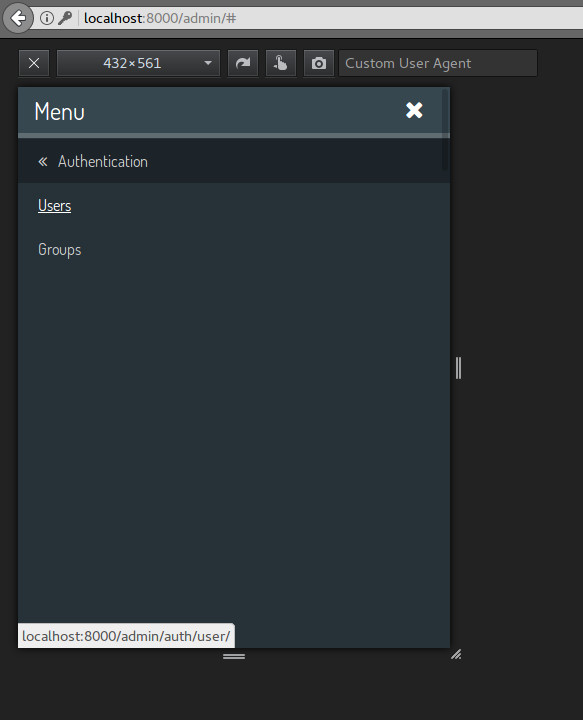
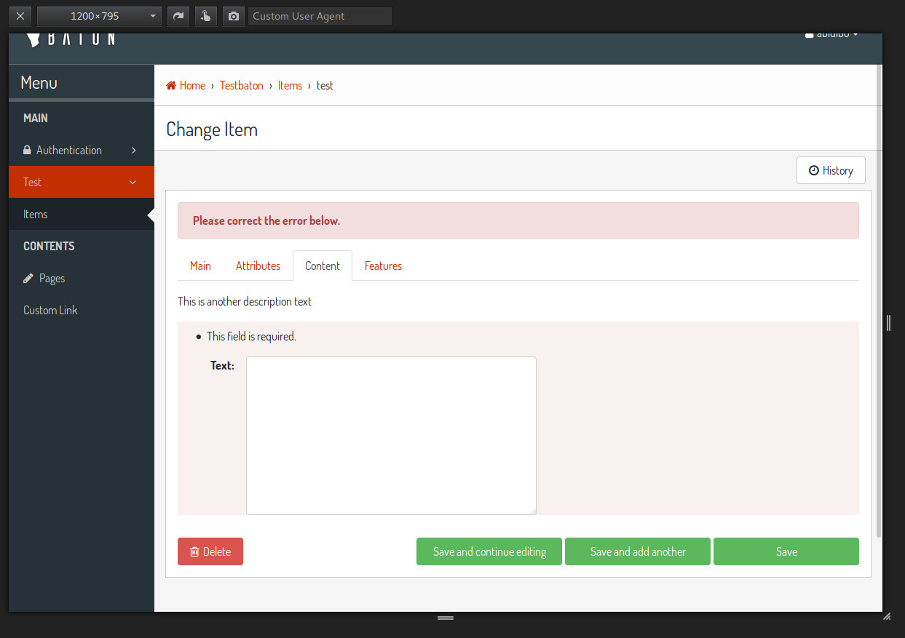
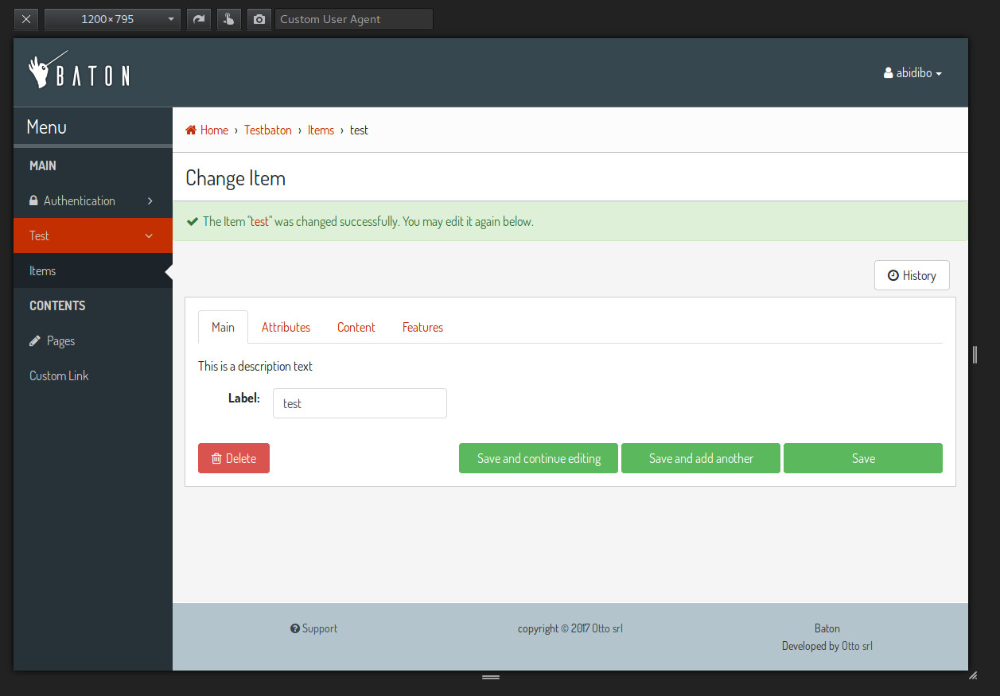

.. django-baton documentation master file, created by
   sphinx-quickstart on Wed Feb 15 12:25:38 2017.
   You can adapt this file completely to your liking, but it should at least
   contain the root `toctree` directive.

django-baton's documentation
========================================

A cool, modern and responsive django admin application based on bootstrap 4.3.1

Baton was developed with one concept in mind: **overwrite as few django templates as possible**.
Everything is done with css (sass and bootstrap mixins), and when the markup needs some edit, then DOM manipulation through js is used.

Features
--------

- Tested with django 1.10.5, 1.11.1, 2.0, 2.1 and 2.2
- Based on bootstrap 4.3.1 and FontAwesome 5.8.1
- Fully responsive
- Custom and flexible sidebar menu
- Text input filters facility
- Configurable form tabs
- Lazy load of current uploaded images
- Optional index page filled with google analytics widgets
- Full customization available recompiling the provided js app
- it translations

Getting started
---------------

.. toctree::
   :maxdepth: 2

   installation
   configuration
   signals
   text_input_filters
   form_tabs

Advanced customization
----------------------

.. toctree::
   :maxdepth: 2

   customization

Screenshots
-----------

.. image:: images/screen5.jpg
.. image:: images/screen6.jpg

